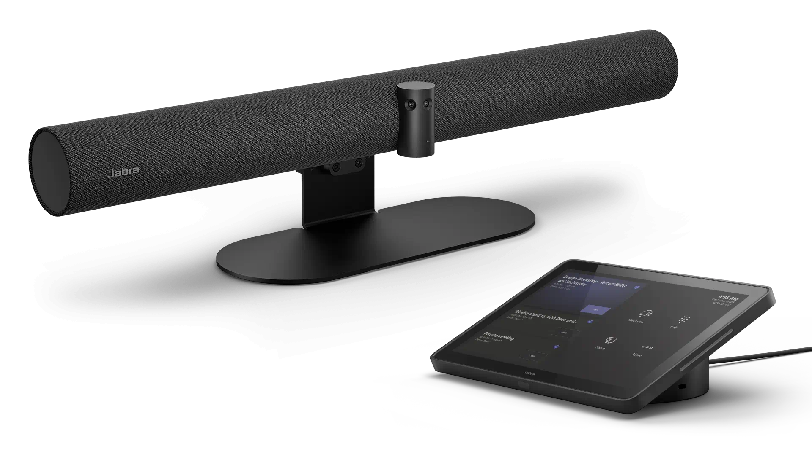
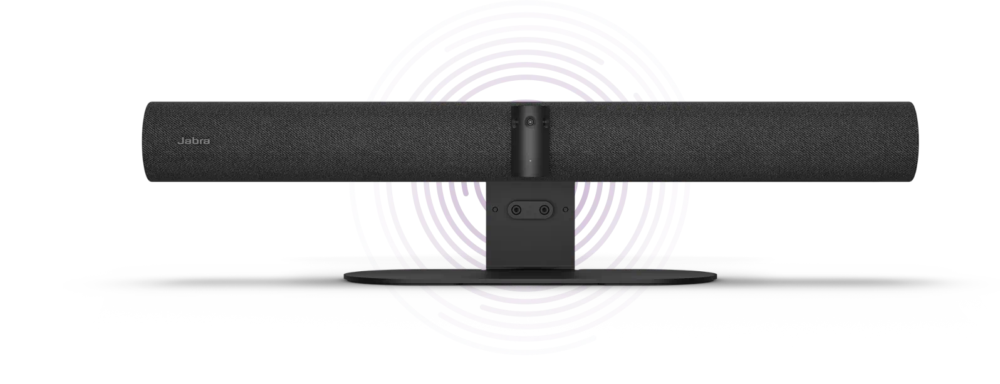

# Jabra

Beam in from your Toronto armchair to a Tokyo boardroom in a fraction of the second. Jabra's cutting-edge video technology will have you looking the business.

Jabra complements Teams Meeting Rooms with professional-grade audio and a unique 180 degree Panoramic 4K Video solution.

Until recently, Jabra was offering the PanaCast 50 as a dedicated advanced audio/video bar which is bundled with the compute power of the Lenovo ThinkSmart Core PC (please see Lenovo page for mode details).

Jabra launched their own PanaCast 50 Video Bar System, excellent for small and midsize rooms.

## Small & Midsize Room

### Android

- **Jabra PanaCast 50 Video Bar System** [🔗](https://www.jabra.com/business/video-conferencing/jabra-panacast-50-video-bar-system/teams)

PanaCast 50 Video Bar System was built for inclusion, so Jabra has gone all-in to make sure video keeps everyone in the frame. Three 13-megapixel cameras, mounted in a high-precision multi-camera array, cover every part of the room so you can get the most out of your meeting spaces and no one falls off the end of the screen.
Jabra's crisp, high-definition, patented real-time video stitching technology uses advanced algorithms to pinpoint the best way to live-stitch the three streams together as the meeting’s happening, creating a smooth, zero-latency 180° field of view in distortion-free Panoramic-4K.

Meetings are better when everyone can actually hear what’s being said.
So as you’d expect from the world leaders in professional audio, PanaCast 50 Video Bar System makes sure your teams’ meetings sound as incredible as they look.
It adapts to whatever space they’re in, using four powerful speakers in a zero-vibration stereo setup to flood the room with premium high-definition sound. That means even those sat all the way at the back will still know exactly what’s going on. And remote participants will hear things perfectly too.

Jabra PanaCast 50 Video Bar System has an easy-to-use PanaCast Control touchscreen tablet to manage everything, your teams can simply walk into their next meeting and instantly get going - directly joining, sharing content, and ending meetings with a simple tap.

