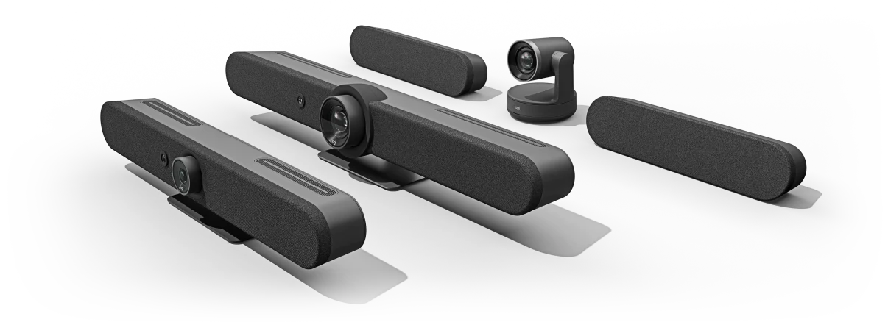
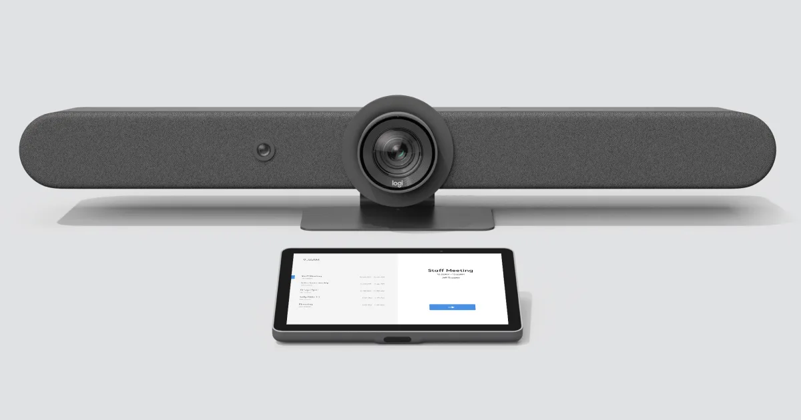
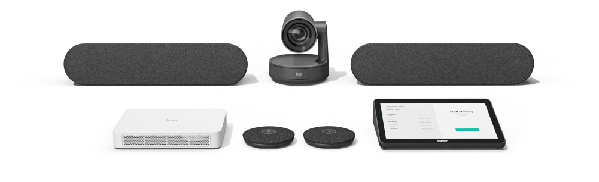
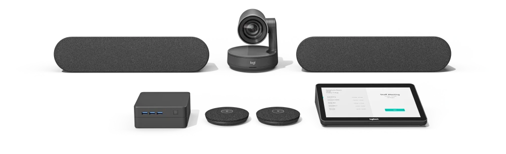
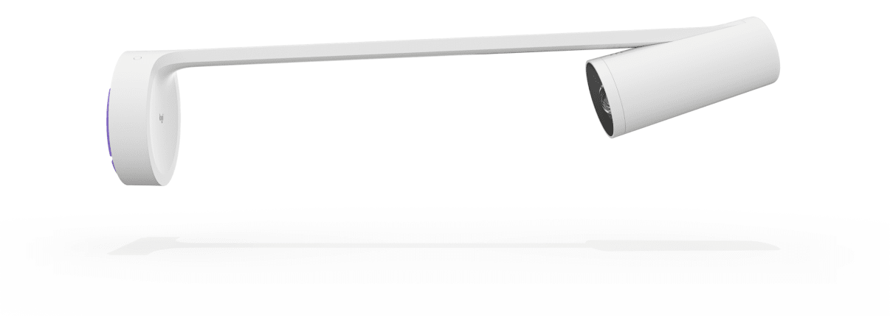

# Lenovo [🔗](https://www.lenovo.com/us/en/c/smart-devices/smart-office/thinksmart/)

**Smart Collaboration Devices**

ThinkSmart solutions can help your return to the office to be more collaborative and productive. We offer flexibility across platforms and room sizes so you can redefine your meeting space. And with ThinkShield, our integrated suite of security solutions, you can trust your data will remain safe and your privacy intact.

Lenovo offers dedicated solutions based on Teams Meeting Rooms on Windows.

## Focus Room & Small Room

- **ThinkSmart Hub Gen 2 for Microsoft Teams Rooms** [🔗](https://www.lenovo.com/us/en/p/smart-devices/smart-office/thinksmart/thinksmart-hub-60/11sp1tshb60)

**Meetings just got easier**

- Built on Microsoft Teams platform with 8th Gen Intel® Core™ processors
- Redesigned, slimmer with a sleeker display
- More speakers, microphones and visible indicator lights
- An innovative single-cable mechanism
- Scalable across room sizes and features one-touch meeting start
- Provides the best possible Microsoft Teams experience

The ThinkSmart Hub makes collaborating easy, whether it’s across town or around the globe. Start your meetings on time, manage your cables, communicate via voice and chat in real time on Microsoft Teams, and share control with the rotatable display. Designed for small- and medium-sized rooms, this smart room device easily scales across a range of room sizes with a mix of curated accessories, providing a solution for a variety of environments.
With one-touch meeting start, participants can avoid dial-in delays and begin collaborating immediately via the ThinkSmart Hub. IT professionals can use the ThinkSmart Manager console to deploy, monitor, manage, and troubleshoot all Hub devices from one centralized location, while optional Smart Office Professional Services provide additional, personalized support.
Don’t miss a word— the ThinkSmart Hub’s four built-in, premium-tuned 3W speakers and four dual-array mics will fill the meeting room and participants’ remote locations with crystal-clear audio. The 10.1 inch antiglare, smudge-resistant display features FHD (1920 x 1200) resolution and 320 Nits brightness. And the device has a minimal footprint and a clutter-reducing single-cable mechanism.
The ThinkSmart Hub for Microsoft Teams is backed by ThinkShield—the most comprehensive, end-to-end security solution on the market. Combining industry-leading secure hardware, software, services, and processes, ThinkShield protects your privacy and your data. Keep your collaboration secure.

For the ThinkSmart Hub you can interconnect any compabitle USB Camera. Lenovo recommends the ThinkSmart Cam for a Focus/Small Room deployment.

- **ThinkSmart Cam** [🔗](https://www.lenovo.com/us/en/p/accessories-and-software/webcams-and-video/webcams-&-video_webcams/40cltscam1)

## Midsize Room

- **Lenovo ThinkSmart One + Controller for Teams** [🔗](https://www.lenovo.com/us/en/p/coming-soon/thinksmart-one-plus-controller-for-teams/len102e0006)

## Large Room

### Android

- **Rally Bar + TAP IP** [🔗](https://www.logitech.com/en-us/products/video-conferencing/room-solutions/rallybar.960-001308.html)

All-in-one video bar for medium to large rooms.
With a dual-camera system and RightSight 2 auto-framing technology, Rally Bar welcomes remote participants to the conversation. Choose Grid View to eliminate empty space and frame each person in their own stream, Speaker View to highlight the active speaker, or Group View to capture everyone in the room. An innovative dual-camera system with optical zoom and an AI Viewfinder delivers fluid, cinematic video in medium and large rooms. ally Bar’s advanced audio engineering delivers powerful, room-filling sound and makes sure every voice is clearly heard. Easily accommodate larger spaces with Rally Mic Pods. Out of the box, Rally Bar has a pickup range up to 23 ft (7 m), which you can significantly extend by adding up to four Mic Pods.

- **Rally PLUS with RoomMate** (Modular solution) [🔗](https://www.poly.com/us/en/solutions/platform/microsoft/video/teams-rooms-windows)

Premier modular video conferencing system for large rooms
In large rooms with one or two displays, deploy Rally with tremendous flexibility and ease. In large rooms with one or two displays, deploy Rally with tremendous flexibility and ease. Using AI, human perception, and automated PTZ, Rally adapts to meeting dynamics and keeps the camera on the action. Rally’s ultra-low distortion speakers deliver crystal clear, room-filling sound and make sure every voice is clearly heard. Rally’s exquisitely sensitive mic pods ensure that everyone in the meeting is clearly heard.

### Windows

- **Rally PLUS with Intel NUC/Lenovo/DELL Compute** (Modular solution) [🔗](https://www.poly.com/us/en/solutions/platform/microsoft/video/teams-rooms-windows)

Premier modular video conferencing system for large rooms
In large rooms with one or two displays, deploy Rally with tremendous flexibility and ease. In large rooms with one or two displays, deploy Rally with tremendous flexibility and ease. Using AI, human perception, and automated PTZ, Rally adapts to meeting dynamics and keeps the camera on the action. Rally’s ultra-low distortion speakers deliver crystal clear, room-filling sound and make sure every voice is clearly heard. Rally’s exquisitely sensitive mic pods ensure that everyone in the meeting is clearly heard.

## More compatible Logi devices

### Logitech Sight  [🔗](https://www.logitech.com/en-us/products/video-conferencing/room-solutions/sight.960-001510.html)

Make Microsoft Teams meetings more inclusive for remote participants with Sight, which adds clearer audio and the best front-facing view of in-room participants.
Tabletop companion camera with intelligent multi-participant framing. Get the best front-and-center view of the room, from anywhere.
A new approach combines Sight at the table with the front-of-room video bar to show the best angle of meeting room interactions.
With Rally Bar at the front of the room, and Sight at the center of the table, you maintain a consistent front-facing view of in-person interactions as the conversation flows between in-room and remote participants.

### Logitech Scribe  [🔗](https://www.logitech.com/en-us/products/video-conferencing/room-solutions/scribe.960-001332.html)

Whiteboard camera for video conferencing rooms
Effortlessly share whiteboards into video meetings with Logitech Scribe, an AI-powered whiteboard camera for Microsoft Teams® Rooms. This solution takes advantage of the "Content from Camera" feature within Microsoft Teams.
With built-in AI and a custom lens, Scribe broadcasts whiteboard content into video meetings with outstanding clarity. Now, even remote participants can have the best seat at the table. Scribe’s wireless share button makes sharing whiteboards into video meetings quick and easy. You can also initiate sharing with your meeting room touch controller, like Logitech Tap.

