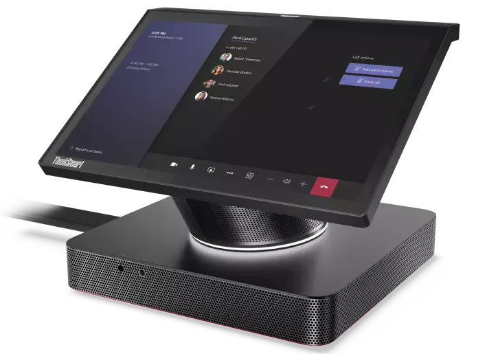
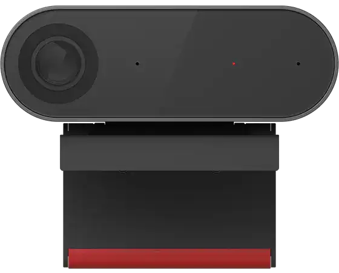
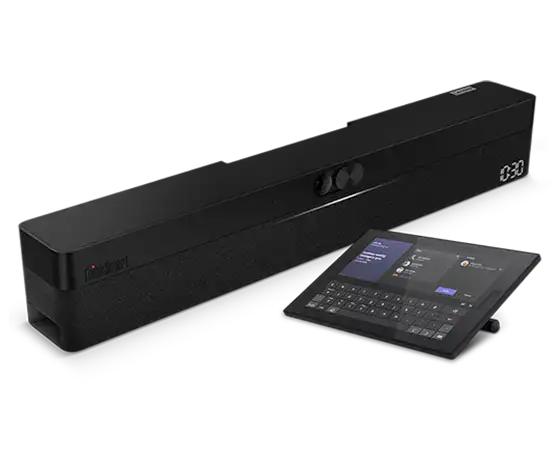
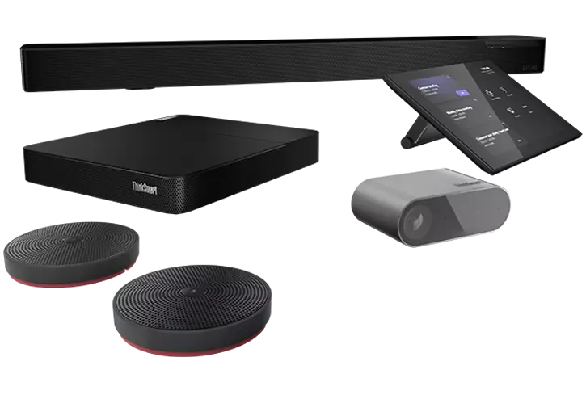
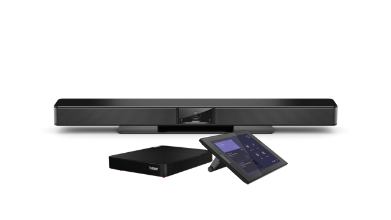
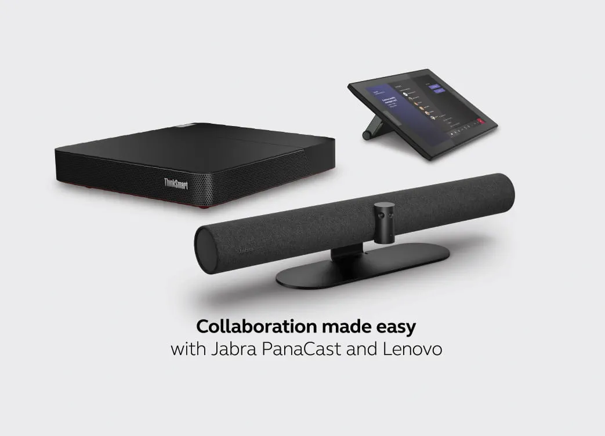

# Lenovo [🔗](https://www.lenovo.com/us/en/c/smart-devices/smart-office/thinksmart/)

**Smart Collaboration Devices**

ThinkSmart solutions can help your return to the office to be more collaborative and productive. We offer flexibility across platforms and room sizes so you can redefine your meeting space. And with ThinkShield, our integrated suite of security solutions, you can trust your data will remain safe and your privacy intact.

Lenovo offers dedicated solutions based on Teams Meeting Rooms on Windows.

## Focus Room & Small Room

- **ThinkSmart Hub Gen 2 for Microsoft Teams Rooms** [🔗](https://www.lenovo.com/us/en/p/smart-devices/smart-office/thinksmart/thinksmart-hub-60/11sp1tshb60)

**Meetings just got easier**

- Built on Microsoft Teams platform with 8th Gen Intel® Core™ processors
- Redesigned, slimmer with a sleeker display
- More speakers, microphones and visible indicator lights
- An innovative single-cable mechanism
- Scalable across room sizes and features one-touch meeting start
- Provides the best possible Microsoft Teams experience

The ThinkSmart Hub makes collaborating easy, whether it’s across town or around the globe. Start your meetings on time, manage your cables, communicate via voice and chat in real time on Microsoft Teams, and share control with the rotatable display. Designed for small- and medium-sized rooms, this smart room device easily scales across a range of room sizes with a mix of curated accessories, providing a solution for a variety of environments.
With one-touch meeting start, participants can avoid dial-in delays and begin collaborating immediately via the ThinkSmart Hub. IT professionals can use the ThinkSmart Manager console to deploy, monitor, manage, and troubleshoot all Hub devices from one centralized location, while optional Smart Office Professional Services provide additional, personalized support.
Don’t miss a word— the ThinkSmart Hub’s four built-in, premium-tuned 3W speakers and four dual-array mics will fill the meeting room and participants’ remote locations with crystal-clear audio. The 10.1 inch antiglare, smudge-resistant display features FHD (1920 x 1200) resolution and 320 Nits brightness. And the device has a minimal footprint and a clutter-reducing single-cable mechanism.
The ThinkSmart Hub for Microsoft Teams is backed by ThinkShield—the most comprehensive, end-to-end security solution on the market. Combining industry-leading secure hardware, software, services, and processes, ThinkShield protects your privacy and your data. Keep your collaboration secure.

For the ThinkSmart Hub you can interconnect any compabitle USB Camera. Lenovo recommends the ThinkSmart Cam for a Focus/Small Room deployment.

- **ThinkSmart Cam** [🔗](https://www.lenovo.com/us/en/p/accessories-and-software/webcams-and-video/webcams-&-video_webcams/40cltscam1)

## Midsize Room

- **Lenovo ThinkSmart One + Controller for Teams** [🔗](https://www.lenovo.com/us/en/p/coming-soon/thinksmart-one-plus-controller-for-teams/len102e0006)

Meet the ideal solution for seamless & productive meetings.

With Windows-based computing built in, ThinkSmart One is self-contained. This smart bar boasts a high-res camera with an extra-wide field of view and smart features like auto-zoom, auto-frame, people counting, speaker tracking, and whiteboard awareness. Expect sharp contrast, vivid colors, and brighter images even in low-light environments. As for sound, stereo speakers deliver crisp clarity with high-volume capacity and range, while 8 mics with both echo and noise cancellation and 180-degree coverage ensure everyone is heard loud and clear.
The ThinkSmart Controller is a stunning 10.1″ HD display with 10-point multitouch. It includes the familiar Microsoft Teams interface, with its easy-to use navigation for initiating and controlling meetings, and sharing content. One-touch join function gets your meetings up and running instantly, and thanks to the antiglare and antifingerprint finish, the display is sure to remain smudge-free and looking good.

- The world’s first Windows-based integrated collaboration solution
- Integrated bar with FHD camera, premium audio, & Windows computing
- 10.1″ HD controller with one-touch join function
- Powered by 11th Gen Intel® Core™ processors with vPro®
- Easy to use, manage, & configure via complimentary ThinkSmart Manager Premium
- Ideal for small-to-medium sized workspaces

The ThinkSmart One integrated bar includes a wall-mount bracket that enables you to tilt the bar up or down by 10 degrees or leave it level. Simply adjust it to best suit your needs. What’s more, the bracket remains hidden when mounted, providing a clean aesthetic in any meeting room.

## Large Room

- **Lenovo ThinkSmart Core Full Room Kit for Microsoft Teams Rooms** [🔗](https://www.lenovo.com/us/en/p/smart-devices/smart-office/thinksmart/thinksmart-core-full-room-kit-t/len102e0002)

Complete unified communications solution certified for Teams Rooms

Add smarter collaboration technology to meeting rooms of all sizes with our ThinkSmart Core Full Room Kit T—a one-stop solution for all of your unified communications needs. Kit includes ThinkSmart Core computing device certified for Microsoft Teams Rooms, Controller display, smart AI-based camera, smart soundbar with mics, Premier Support plan, and premium software for remote manageability, deployment, and more.

## More compatible cross-collaborations based on the Lenovo ThinkSmart Core PC

### BOSE VideoBar VB1  [🔗](https://www.boseprofessional.com/en_us/products/conferencing/videobars/bose-videobar-vb1.html)

Bose Professional Videobar VB1 is an all-in-one USB conferencing device that brings premium audio and video to huddle spaces to medium-sized meeting rooms up to 6 x 6 meters (20 x 20 feet). With six automatic beam-steering microphones, a 4K ultra-HD camera, and signature sound, the Videobar VB1 helps you huddle up and get more done. Works with Microsoft Teams, and connected to a Lenovo ThinkSmart Core PC it can be transformed from a classic BYOD scenario, to a modern Teams Meeting Rooms Solution.

### Jabra Panacast 50  [🔗](https://www.jabra.com/business/for-your-platform/lenovo)

The Jabra PanaCast 50 & Lenovo™ ThinkSmart™ Core solution bring a new level of intuitive and seamless video conferencing collaboration to businesses looking to upgrade meeting rooms.The solution provides an enterprise-ready conferencing solution that is pre-configured for Microsoft Teams.

[More info on this solution](./../../images/vendors/lenovo/JabraLenovo.pdf)

[**Back to Providers**](./../../hardware/providers.md)