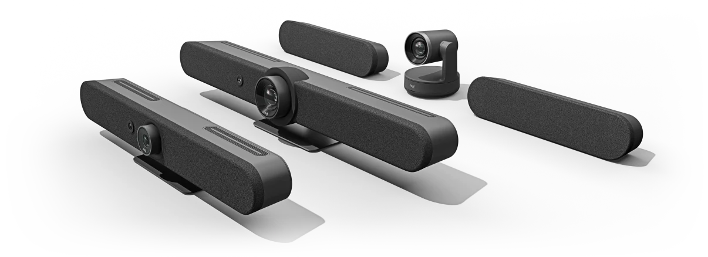
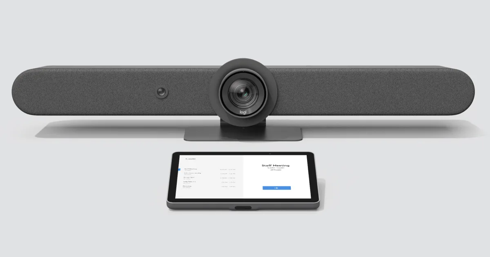
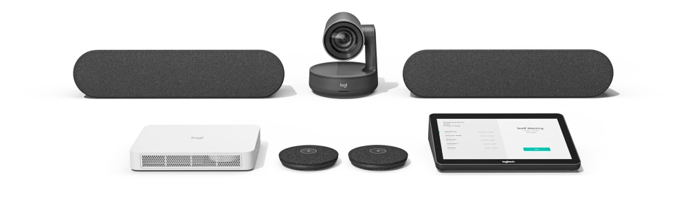
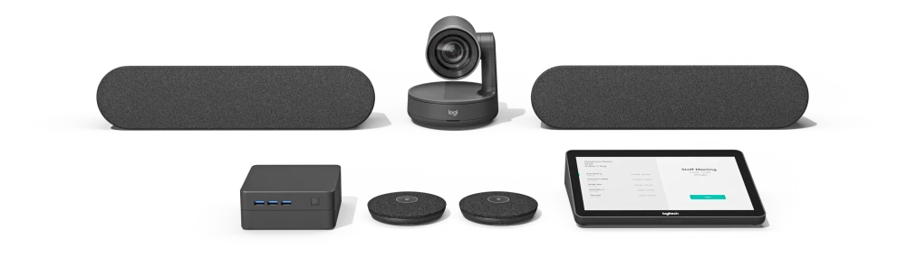
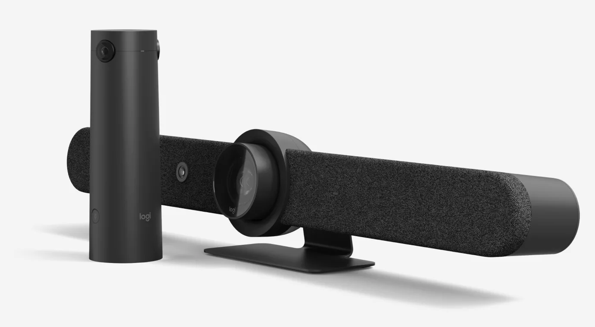
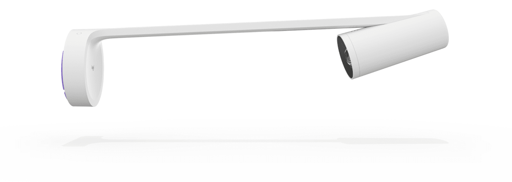

# Logitech [🔗](https://www.logitech.com/en-us/video-collaboration/partners/microsoft.html)

**BRING TEAMS TOGETHER**

Logitech and Microsoft Teams work together to foster inclusive meeting experiences for people and teams, no matter their location. Our ecosystem of software, services, and Microsoft Teams Rooms-certified hardware are easy to deploy at scale, simple to use and manage, and seamlessly connect hybrid workplaces for everyone.

## Data Sheet for Logitech Solutions for Microsoft Teams Rooms on Windows [🔗](https://www.logitech.com/content/dam/logitech/en/video-collaboration/pdf/microsoftrooms.pdf)

## Focus Room

### Android

- **Rally Bar Huddle** [🔗](https://www.logitech.com/en-us/products/video-conferencing/room-solutions/rallybarhuddle.960-001485.html)

Featuring a sleek design and robust technology - Rally Bar Huddle is a straightforward and powerful solution for small spaces. Ensure everyone can be seen and heard clearly during hybrid meetings. AI video intelligence, advanced sound pickup, noise suppression, and ongoing software improvements provide a clear and natural meeting experience for remote workers.

- **TAP IP Console** [🔗](https://www.logitech.com/en-us/products/video-conferencing/room-solutions/tap-ip.952-000085.html)

Make video meetings simple to join with a network-connected touch controller.

### Windows

- **Rally Bar Huddle with Logitech TAP and Lenovo/DELL Compute** (Rally Bar Huddle, TAP Console, Lenovo/DELL PC) [🔗](https://www.logitech.com/en-us/business/solutions/huddle-space.html)

## Small Room

### Android

- **Rally Bar Mini** [🔗](https://www.logitech.com/en-us/products/video-conferencing/room-solutions/rallybarmini.960-001336.html)

Premier all-in-one video bar for small to midsize rooms.
With a dual-camera system and RightSight 2 auto-framing technology, Rally Bar welcomes remote participants to the conversation. Choose Grid View to eliminate empty space and frame each person in their own stream, Speaker View to highlight the active speaker, or Group View to capture everyone in the room. Rally Bar Mini’s advanced audio engineering delivers rich, natural sound and makes sure every voice is clearly heard. Easily accommodate larger spaces with Rally Mic Pods. Out of the box, Rally Bar Mini has a pickup range up to 23 ft (7 m), which you can significantly extend by adding up to three Mic Pods.

- **Logitech TAP** [🔗](https://www.logitech.com/en-us/products/video-conferencing/room-solutions/tap.939-001950.html)

Make video meetings simple to join with a touch controller with wireless and HDMI content-sharing.

### Windows

- **Tap small room system with Intel NUC** (Logitech MeetUp, TAP Console, Intel NUC)
- **Rally Bar Mini with Logitech TAP and Lenovo/DELL Compute** (Rally Bar Mini, TAP Console, Lenovo/DELL PC) [🔗](https://www.logitech.com/en-us/business/solutions/ideation-space.html)

## Midsize Room

### Android

- **Rally Bar + TAP IP** [🔗](https://www.logitech.com/en-us/products/video-conferencing/room-solutions/rallybar.960-001308.html)

All-in-one video bar for medium to large rooms.
With a dual-camera system and RightSight 2 auto-framing technology, Rally Bar welcomes remote participants to the conversation. Choose Grid View to eliminate empty space and frame each person in their own stream, Speaker View to highlight the active speaker, or Group View to capture everyone in the room. An innovative dual-camera system with optical zoom and an AI Viewfinder delivers fluid, cinematic video in medium and large rooms. ally Bar’s advanced audio engineering delivers powerful, room-filling sound and makes sure every voice is clearly heard. Easily accommodate larger spaces with Rally Mic Pods. Out of the box, Rally Bar has a pickup range up to 23 ft (7 m), which you can significantly extend by adding up to four Mic Pods.

### Windows

- **Rally Bar with Logitech TAP and Intel NUC/Lenovo/DELL Compute** [🔗](https://www.logitech.com/en-us/business/solutions/traditional-conference-room.html)

## Large Room

### Android

- **Rally Bar + TAP IP** [🔗](https://www.logitech.com/en-us/products/video-conferencing/room-solutions/rallybar.960-001308.html)

All-in-one video bar for medium to large rooms.
With a dual-camera system and RightSight 2 auto-framing technology, Rally Bar welcomes remote participants to the conversation. Choose Grid View to eliminate empty space and frame each person in their own stream, Speaker View to highlight the active speaker, or Group View to capture everyone in the room. An innovative dual-camera system with optical zoom and an AI Viewfinder delivers fluid, cinematic video in medium and large rooms. ally Bar’s advanced audio engineering delivers powerful, room-filling sound and makes sure every voice is clearly heard. Easily accommodate larger spaces with Rally Mic Pods. Out of the box, Rally Bar has a pickup range up to 23 ft (7 m), which you can significantly extend by adding up to four Mic Pods.

- **Rally PLUS with RoomMate** (Modular solution) [🔗](https://www.poly.com/us/en/solutions/platform/microsoft/video/teams-rooms-windows)

Premier modular video conferencing system for large rooms
In large rooms with one or two displays, deploy Rally with tremendous flexibility and ease. In large rooms with one or two displays, deploy Rally with tremendous flexibility and ease. Using AI, human perception, and automated PTZ, Rally adapts to meeting dynamics and keeps the camera on the action. Rally’s ultra-low distortion speakers deliver crystal clear, room-filling sound and make sure every voice is clearly heard. Rally’s exquisitely sensitive mic pods ensure that everyone in the meeting is clearly heard.

### Windows

- **Rally PLUS with Intel NUC/Lenovo/DELL Compute** (Modular solution) [🔗](https://www.poly.com/us/en/solutions/platform/microsoft/video/teams-rooms-windows)

Premier modular video conferencing system for large rooms
In large rooms with one or two displays, deploy Rally with tremendous flexibility and ease. In large rooms with one or two displays, deploy Rally with tremendous flexibility and ease. Using AI, human perception, and automated PTZ, Rally adapts to meeting dynamics and keeps the camera on the action. Rally’s ultra-low distortion speakers deliver crystal clear, room-filling sound and make sure every voice is clearly heard. Rally’s exquisitely sensitive mic pods ensure that everyone in the meeting is clearly heard.

## More compatible Logi devices

### Logitech Sight  [🔗](https://www.logitech.com/en-us/products/video-conferencing/room-solutions/sight.960-001510.html)

Make Microsoft Teams meetings more inclusive for remote participants with Sight, which adds clearer audio and the best front-facing view of in-room participants.
Tabletop companion camera with intelligent multi-participant framing. Get the best front-and-center view of the room, from anywhere.
A new approach combines Sight at the table with the front-of-room video bar to show the best angle of meeting room interactions.
With Rally Bar at the front of the room, and Sight at the center of the table, you maintain a consistent front-facing view of in-person interactions as the conversation flows between in-room and remote participants.

### Logitech Scribe  [🔗](https://www.logitech.com/en-us/products/video-conferencing/room-solutions/scribe.960-001332.html)

Whiteboard camera for video conferencing rooms
Effortlessly share whiteboards into video meetings with Logitech Scribe, an AI-powered whiteboard camera for Microsoft Teams® Rooms. This solution takes advantage of the "Content from Camera" feature within Microsoft Teams.
With built-in AI and a custom lens, Scribe broadcasts whiteboard content into video meetings with outstanding clarity. Now, even remote participants can have the best seat at the table. Scribe’s wireless share button makes sharing whiteboards into video meetings quick and easy. You can also initiate sharing with your meeting room touch controller, like Logitech Tap.

[**Back to Providers**](./../../hardware/providers.md)