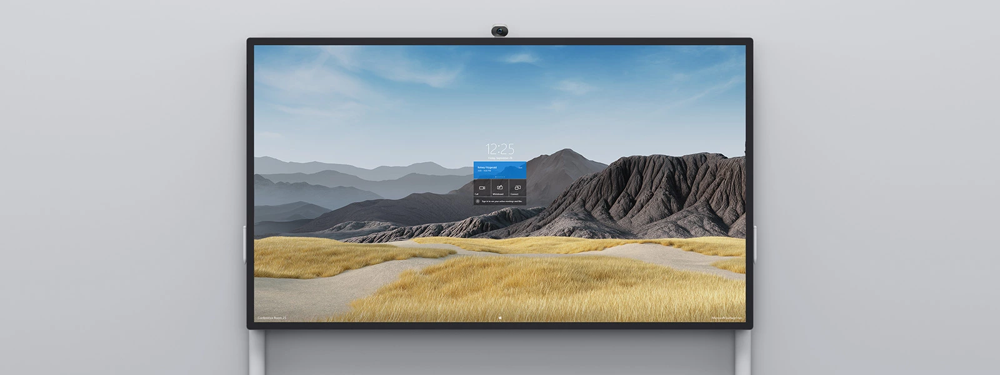
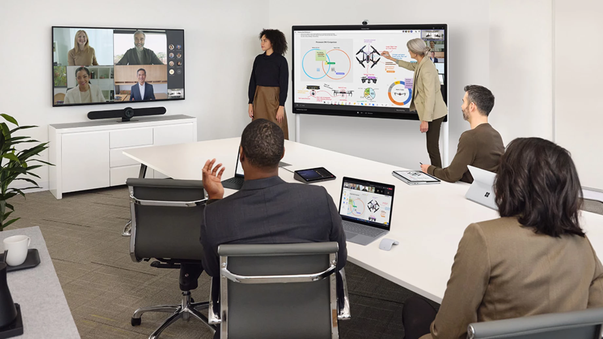

# Microsoft

Bridge the gap between people working remotely and those in the office with a team meeting room solution that allows everyone to be seen, be heard, and fully participate from anywhere.

There is a very limited set of Teams Rooms Devices build by Microsoft directly. The range we are discussing about is solely focused on the Microsoft Surface HUB ecosystem.

The Surface HUB can work as a standalone Teams Rooms Device and/or in strong relationship with other Windows Based Teams Meeting Rooms solutions from Certified for Microsoft Teams Vendors.
The interconnectivity between a Surface HUB and a dedicated Windows Based Teams Meeting Rooms Solution is called ["Coordinated Meetings"](https://learn.microsoft.com/en-us/microsoftteams/rooms/coordinated-meetings)

## Small Room & Midsize Room

 **Surface Hub 2S 50 + Surface Hub 2 Smart Camera** [🔗](https://www.microsoft.com/en-us/surface/business/surface-hub-2)

 Give hybrid teams a more inclusive way to meet and co-create by empowering teamwork anywhere using this interactive whiteboard. Dissolve boundaries for hybrid teams so they can inclusively engage everyone’s voices, faces, and ideas. Surface Hub 2S is a powerful meetings platform for every team, wherever they meet, that’s certified for Microsoft Teams.
 AI-powered Surface Hub 2 Smart Camera (*sold separately for Surface Hub 2S 50, and included with the Surface Hub 2S 80*) auto frames the video feed for remote participants, giving them the best possible view of the room. Remote participants get a dynamic view of in-room interactions with simultaneous, sharp focus on the foreground and background.

 

## Large Room

 **Surface Hub 2S 85** [🔗](https://www.microsoft.com/en-us/surface/business/surface-hub-2)

  

 We strongly advise that for large rooms, the Surface Hub 2S 85 to be setup in Coordinated Meetings mode together with a dedicated Teams Rooms solution.
  
  
