# Poly | HP

Whether it’s a group huddle or an all-staff meeting, just a few remote attendees or mostly virtual, Poly Studio Room Kits for Microsoft Teams Rooms bring everyone together. The complete solution comes fully equipped with Poly AI-driven audio and video technologies, a compact collaboration PC, and easy-to-use touch controller, so your experience is seamless.

## Poly | HP [Special Promo - My First Room](https://www.poly.com/gb/en/promotions/my-first-room)

Below you will find Poly recommendations for each room type, either if you are looking for Android-based systems or Windows-based deployments for Meeting Rooms.

## Focus Room

### Android

- **Poly Studio X30** [🔗](https://www.poly.com/us/en/products/video-conferencing/studio/studio-x30)

The Poly Studio X30 offers legendary audio & video performance in a simple all-in-one video bar, optimized for small meeting spaces. Pinpoint-accurate automatic framing and tracking modes, distraction-free audio technology, and life-like 4K UltraHD video provides true meeting equality across hybrid meetings. All the leading cloud video apps are built right in, meaning familiar controls without the need for a PC. And with Poly Lens, deployment, management and analytics are a breeze for IT.

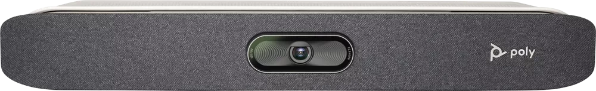

- **Poly TC8 Console** [🔗](https://www.poly.com/gb/en/products/video-conferencing/accessories/tc8)

Intuitive touch interface lets you access Teams meetings features with ease. Its sleek design features an 8" high-resolution touch display to make control options clear and accessible. Launch, join and share in an instant, while keeping your focus on the task at hand.

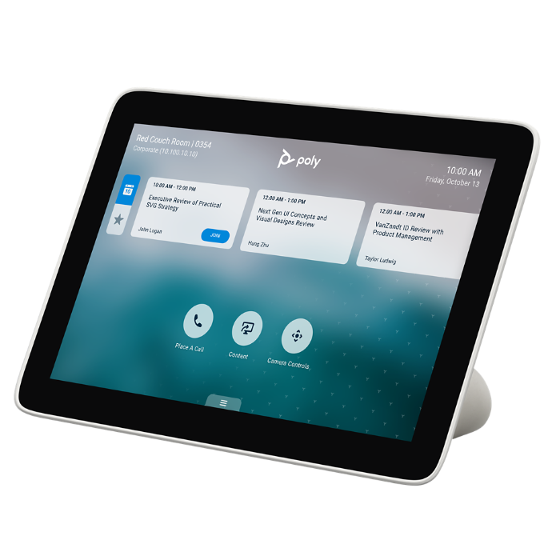

### Windows

- **Poly Focus Room Kit** (Poly Studio P15, Poly GC8) [🔗](https://www.poly.com/us/en/solutions/platform/microsoft/video/teams-rooms-windows)
- **HP Mini Conferencing PC** with Microsoft Teams Rooms

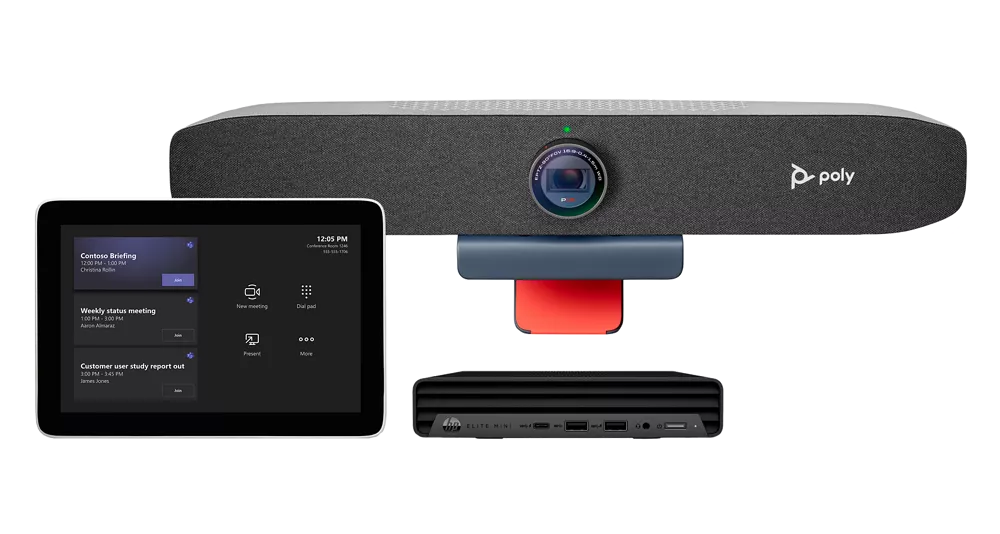

## Small Room

### Android

- **Poly Studio X50** [🔗](https://www.poly.com/us/en/products/video-conferencing/studio/studio-x50)

Experience board-room-quality audio, and knock-your-socks-off video, for mid-sized rooms. The Poly Studio X50 all-in-one video bar is radically simple to use, with support for leading cloud video services built right in — no PC or Mac required. Voices are crisp and clear. Video feels natural. And wireless content sharing lets users collaborate without cables or pucks.

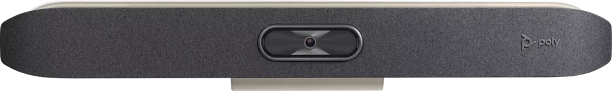

- **Poly TC8 Console** [🔗](https://www.poly.com/gb/en/products/video-conferencing/accessories/tc8)

Intuitive touch interface lets you access Teams meetings features with ease. Its sleek design features an 8" high-resolution touch display to make control options clear and accessible. Launch, join and share in an instant, while keeping your focus on the task at hand.

### Windows

- **Poly Small Room Kit** (Poly Studio R30, Poly GC8) [🔗](https://www.poly.com/us/en/solutions/platform/microsoft/video/teams-rooms-windows)
- **HP Mini Conferencing PC** with Microsoft Teams Rooms

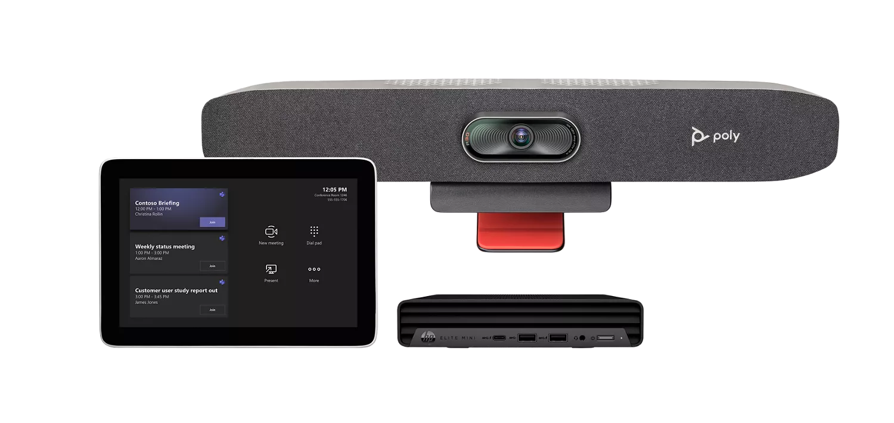

## Midsize Room

### Android

- **Poly Studio X70** [🔗](https://www.poly.com/us/en/products/video-conferencing/studio/studio-x70)

Ready for the best damn meeting experience available? The Poly Studio X70 video bar combines stunning design with razor-sharp 4K video and boardroom-filling stereo that brings your large meeting rooms to life. Its all-in-one construction means you can trash all those annoying cables and stop bothering your IT people for help. And with its AI-driven video and audio experiences, the Poly Studio X70 turns any large-room video call into a hassle-free delight.

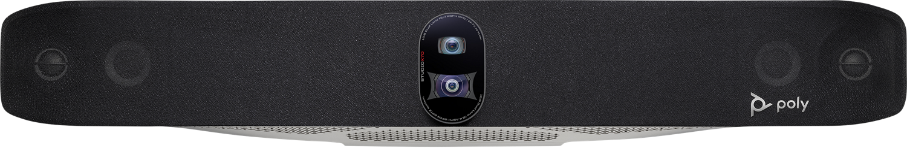

- **Poly TC8 Console** [🔗](https://www.poly.com/gb/en/products/video-conferencing/accessories/tc8)

Intuitive touch interface lets you access Teams meetings features with ease. Its sleek design features an 8" high-resolution touch display to make control options clear and accessible. Launch, join and share in an instant, while keeping your focus on the task at hand.

### Windows

- **Poly Medium Room Kit** (Poly Studio, Poly GC8) [🔗](https://www.poly.com/us/en/solutions/platform/microsoft/video/teams-rooms-windows)
- **HP Mini Conferencing PC** with Microsoft Teams Rooms

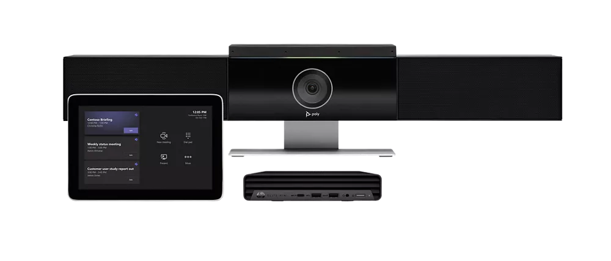

## Large Room

### Android

- **Poly G7500** [🔗](https://www.poly.com/us/en/products/video-conferencing/g/g7500)

If you want more control over your meeting spaces, the Poly G7500 is ready. This modular video conferencing system makes it easy to outfit conference rooms to meet your organization’s unique needs. Loaded with flexible features, the G7500 leverages your design to power your meetings and wow your teams.

- Seamlessly connects to cameras, microphones, and other 3rd party components
- Built-in video apps for native full-featured experiences
- Includes Poly NoiseBlockAI and Acoustic Fence technologies

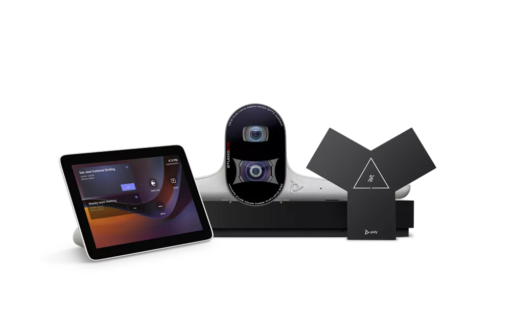

- **Poly TC8 Console** [🔗](https://www.poly.com/gb/en/products/video-conferencing/accessories/tc8)

Intuitive touch interface lets you access Teams meetings features with ease. Its sleek design features an 8" high-resolution touch display to make control options clear and accessible. Launch, join and share in an instant, while keeping your focus on the task at hand.

- **Poly E70** [🔗](https://www.poly.com/us/en/products/video-conferencing/studio/studio-e70)

The Poly Studio E70 is a first-of-its-kind intelligent camera that super-charges meeting rooms with mind-blowing video quality and next-level analytics. Dual camera with 20-megapixel 4K sensors are boosted by Poly DirectorAI smart camera technology to create a completely unrivaled video experience – perfect for hybrid working environments.

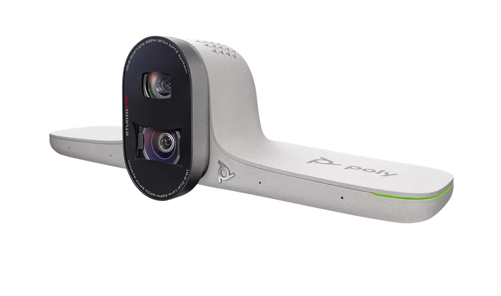

### Windows

- **Poly Large Room Kit** (Poly Studio E70, Poly GC8) [🔗](https://www.poly.com/us/en/solutions/platform/microsoft/video/teams-rooms-windows)
- **HP Mini Conferencing PC** with Microsoft Teams Rooms

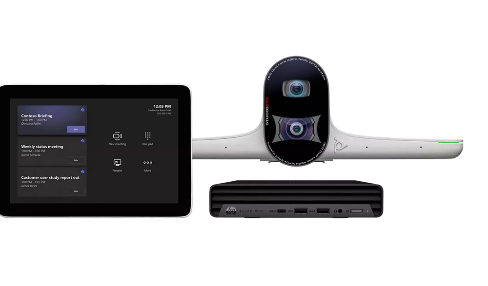

> **Warning**
> **The Poly large room solutions do not include audio capabilities.**
> For audio it is recommended to go with a dedicated provider.
> Example: Nureva HDL300 (1-2 pieces) or standard Poly USB audio devices (Poly Sync 40-M [🔗](https://www.poly.com/us/en/products/phones/sync/sync-40), Poly Sync 60-M [🔗](https://www.poly.com/us/en/products/phones/sync/sync-60) and/or Poly Trio C60 [🔗](https://www.poly.com/us/en/products/phones/trio/trio-c60)).

## More details on above-mentioned products and solutions

## Poly GC8 Touch Console [🔗](https://www.poly.com/us/en/support/products/video-conferencing/group-solutions/poly-gc8)
The Poly GC8’s intuitive touch interface provides easy access to Poly Window-based conferencing solutions.

Poly GC8 features:

- Compatible with Microsoft Teams Rooms on Windows
- Integrated calendar for one-touch to join a call
- Easily share content, adjust the camera, and change participant layouts
- HDMI Ingest cable support

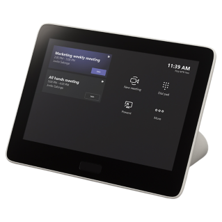

> **Warning**
> The Poly GC8 Touch Console only work with Windows-based certified Teams compute devices, while the Poly TC8 Touch Console will work only with Android-based systems: X-Series and G7500.

## The HP Mini Conferencing PC with Microsoft Teams Rooms

*The HP Mini Conferencing PC delivers power and performance from every angle with the latest 12th Gen Intel® Core™ i7.*

Empower your teams with rich, collaborative experiences across town and around the world in an instant. The HP Mini Conferencing PC with Microsoft Teams Rooms is designed to work with Poly Studio Room Kits for Microsoft Teams Rooms.

Setting up your conferencing space is fast and easy with the latest Intel® processor driven PC that has Microsoft Teams Rooms preinstalled
Get a highly secure and manageable PC that has the self-healing protection of HP Sure Start Gen7.
Get powerful performance from Windows IoT and the latest Intel® processor
HP Mini Conferencing PC with Microsoft Teams Rooms.

- 12th Generation Intel® Core™ i7 (12700T)
- 16GB RAM
- 256GB SSD

This is one of the most powerful compute options for Microsoft Teams Rooms on Windows you may find on the market.