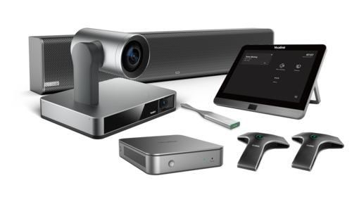
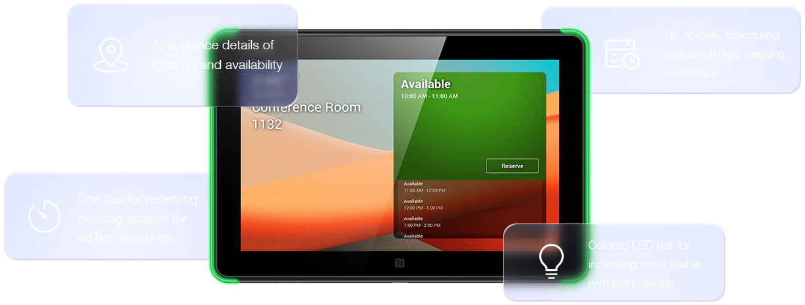
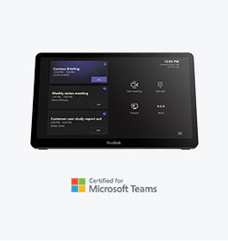
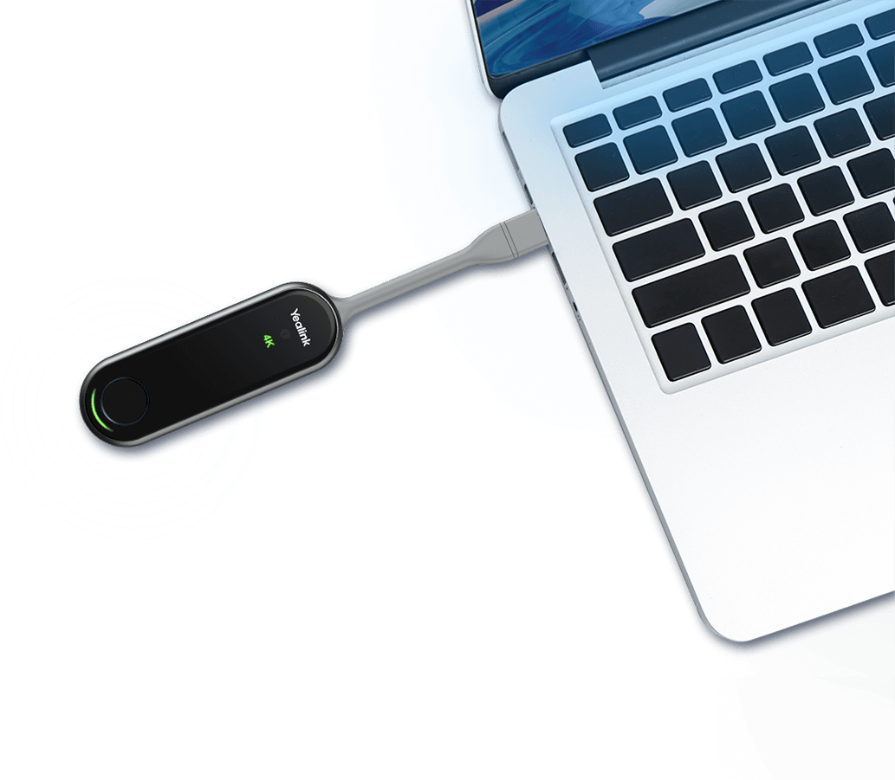
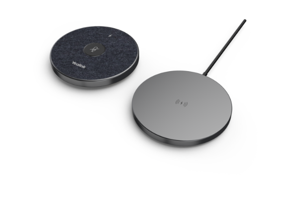

# Yealink

Yealink Video Device Solutions for Microsoft Teams, Empowering Your Business

In the modern teams conference room, organization employees tend to do communication and collaboration with video meeting.

A video meeting not only delivers instant collaboration and communication environment, but fosters productivity and sometimes sparks innovations in a team work.

Fully integrated with Microsoft Teams and cover all the meeting room size, Yealink Teams room system solutions comes with full package devices offer including everything you need for a Microsoft Teams meeting room. Easy to use with premium video and audio experience, the solutions are able to make the teamwork more efficient and collaborative across all meeting spaces.

Below you will find Poly recommendations for each room type, either if you are looking for Android-based systems or Windows-based deployments for Meeting Rooms.

## Focus & Small Room

### Android

- **Yealink MeetingBar A10** [🔗](https://https://www.yealink.com/en/product-detail/microsoft-teams-rooms-meetingbar-a10)

The MeetingBar A10's compact design makes it perfect for small spaces and home offices, and it can be set up in minutes. With 4K camera and 120° field of view, capture all important details in the room clearly with great color. The built-in 8 MEMS beamforming microphones and speakers in MeetingBar A10 provide full coverage of small spaces for a worry free, full-duplex voice experience. Yealink's enhanced AI noise cancellation enhances the audio experience, leveraging a massive deep-learning sound database to reduce background noises, distracting keyboard clatter, mouse clicks, and footsteps, as well as smartly erase other ambient noises to provide crystal-clear audio quality.

Being integrated into a Focus Room, we recommend adding a touchscreen enabled monitor into the room and connect it to the A10. This way, the controlling part of the Meeting Room will be handled directly on the monitor. Otherwise, we recommend adding a CTP18 Touch Panel for meeting control directly on the meeting table. THe CTP18 Touch Panel is described below.

- **Yealink MeetingBar A20 with CTP18 Touch Panel** [🔗](https://www.yealink.com/en/product-detail/microsoft-teams-rooms-meetingbar-a20)

Designed with simplicity, Yealink MeetingBar A20 integrates the conference room webcam, microphone and speakers into an all-in-one system. No PC or individual components are required, allowing plug-and-play for a dedicated small meeting room setup within minutes, greatly reducing the time needed for deployment and management. In addition, connecting to a CTP18 touch panel can be realized for better meeting control.

### Windows

- **Yealink MVC400** (Yealink UVC40 Camera, Yealink MCore Mini-PC, MTouch II Touch Panel) [🔗](https://www.yealink.com/en/product-detail/microsoft-teams-rooms-mvc400)

Getting started with Yealink UVC40, the all-in-one USB video bar offers a video and voice experience with an integrated AI-powered camera, microphone arrays and speaker. With the MTouch II and MCore mini-PC, Yealink MVC400 video solution for Teams conference rooms brings a dedicated MTR system that meets the requirements of focus and small meeting rooms. The Yealink UVC40 is equipped with AI technology, including Auto Framing and Speaker Tracking. With the 133° wide-angle lens and Auto Framing, the UVC40 can recognize the number of and the position of attendees, framing everyone smoothly in the most appropriate view even in small spaces. The Speaker Tracking technology with 20MP camera brings a vivid face-to-face meeting in a high-definition visual experience. In addition, with an electric lens cap, the UVC40 camera can automatically turn on and off with the aid of its detection function, securing the privacy of your MVC400 Teams conference rooms. With Yealink Noise Proof Technology and dereverberation, the UVC40 with built-in 8 MEMS microphone arrays and speaker allow users to enjoy full-duplex voice experience seamlessly without interruption and talking freely in a comfortable way. In Yealink MVC II series Microsoft Teams conference room equipments, the MCore cable management solution integrates data transmission and power supply cables into one CAT5e cable, provides a straightforward solution to complicated cabling and reduces the deployment time in your Teams conference room. For MVC400 Teams conference room system, easy deployment can be realized with just connecting the MTouch II and the UVC40 to the MCore mini-PC.

## Midsize Room

### Android

- **Yealink MeetingBoard 65/85** [🔗](https://www.yealink.com/en/product-detail/microsoft-teams-rooms-meetingboard65)

Yealink MeetingBoard consists of a 4K camera, crystal-clear speaker, full-duplex microphones, and a 65/86 inch smart collaboration whiteboard to provide an immersive meeting experience and allow collaboration anytime, anywhere. With the 4K camera and powerful encoding and decoding capabilities, MeetingBoard realizes truly smooth and stable HD Teams meetings. Powered by AI technology, the camera brings diverse views such as Auto Framing, Speaker Tracking, Multi-Focus Framing and Picture-in-Picture. MeetingBoard's interactive and inventive features such as premium inking, collaborative diagrams, fluid components, and other rich content, help boost team creativity and productivity. Powered by the Microsoft Whiteboarding, it ensures a seamless real-time collaboration during brainstorming, project planning or problem solving by simple clicks on the smart whiteboard.
This device is excellent in any type of room, from meeting room, training room up to co-creation spaces and manager's office room.

- **Yealink MeetingBar A30 with CTP18 Touch Panel** [🔗](https://www.yealink.com/en/product-detail/microsoft-teams-rooms-meetingbar-a30)

Designed with simplicity, the all-in-one video conferencing bar, Yealink MeetingBar A30 integrates an optical camera, 8 MEMS microphone arrays, and speakers into an all-in-one system. No PC or individual components are required, allowing plug-and-play for a dedicated small meeting room setup within minutes, greatly reducing the time needed for deployment and management. In addition, connecting to a CTP18 touch panel can be realized for better meeting control.

### Windows

- **Yealink MVC860 Bundle Solution** (MVC860) [🔗](https://www.yealink.com/en/product-detail/microsoft-teams-rooms-mvc860)

Designed for medium and large rooms, the Yealink MVC860 Microsoft Teams Rooms system is a bundle video solution with UVC86 4K dual-eye tracking video conference camera, MCore mini-PC and MTouch II touch panel. Users can also select video conference equipment like VCM34/VCM38/CPW90 array microphones and MSpeakerII Soundbar to work with MVC860. The bundle solution brings a premium and native Microsoft Teams Room meeting experience you need to interact, connect and collaborate with internal and external users seamlessly and intelligently.

## Large Room

### Android

- **Yealink MeetingBoard 85** [🔗](https://www.yealink.com/en/product-detail/microsoft-teams-rooms-meetingboard65)

Yealink MeetingBoard consists of a 4K camera, crystal-clear speaker, full-duplex microphones, and a 65/86 inch smart collaboration whiteboard to provide an immersive meeting experience and allow collaboration anytime, anywhere. With the 4K camera and powerful encoding and decoding capabilities, MeetingBoard realizes truly smooth and stable HD Teams meetings. Powered by AI technology, the camera brings diverse views such as Auto Framing, Speaker Tracking, Multi-Focus Framing and Picture-in-Picture. MeetingBoard's interactive and inventive features such as premium inking, collaborative diagrams, fluid components, and other rich content, help boost team creativity and productivity. Powered by the Microsoft Whiteboarding, it ensures a seamless real-time collaboration during brainstorming, project planning or problem solving by simple clicks on the smart whiteboard.
This device is excellent in any type of room, from meeting room, training room up to co-creation spaces and manager's office room.

### Windows

- **Yealink MVC960 Bundle Solution** (MVC960) [🔗](https://www.yealink.com/en/product-detail/microsoft-teams-rooms-mvc960)

Designed for extra-large rooms, the Yealink MVC960 Microsoft Teams Rooms system is a bundle video solution with UVC86 multi-camera system, MCore mini-PC, MTouch II touch panel and AVHub, bringing a premium Teams meeting experience you need to interact, connect and collaborate with internal and external users seamlessly and intelligently. With the AVHub in the bundle, the MVC960 system allows users to enable multiple cameras simultaneously from a single room, better capturing participants and providing different views of the rooms. Moreover, the admin can choose different tracking modes for each camera. In the meantime, remote attendees can view the video feeds of all enabled room cameras in a customized layout, contributing to more industrial scenario applications. Paired with Yealink BYOD Extender, the MVC960 enables multi-camera control even in third-party meetings. All these make Yealink MVC960 a video conferencing equipment for large rooms.

## Recommended accessories on above-mentioned products and solutions

## Yealink RoomPanel for Microsoft Teams [🔗](https://www.yealink.com/en/product-detail/microsoft-teams-roompanel)

**Utilize and Manage Your Meeting Spaces with Exceptional Ease and Efficiency.**

Yealink RoomPanel is one of the dedicated Microsoft Teams devices with compact touchscreen and ideal for mounted outside the meeting spaces for displaying meeting details scheduled via Teams or Outlook 365 calendaring applications.
Moreover, the panel is also enabled for reserving an available room on the spot and indicating current room status.

## Yealink MTouch Plus [🔗](https://www.yealink.com/en/product-detail/accessories-mtouchplus)

With a spacious 11.6-inch 1080P IPS screen, the new MTouch Plus offers a remarkable control experience, ensuring enhanced visibility and convenience. The sleek space black design and premium texture make it an ideal fit for your elegant meeting rooms.

## Yealink WPP30 [🔗](https://www.yealink.com/en/product-detail/video-conferencing-wpp30)

**4K Wireless Presentation Pod for Every Work Space**

Featured with a compact size and intuitive industry design, Yealink wireless presentation pod WPP30 brings a trouble-free content-sharing experience to any conference room. Empowered with up to 4K/30FPS UHD hardware encode streaming output, WPP30 saves a lot of effort by eliminating the installation of any software or driver. Thanks to the high-performance 2x2 MIMO, Wi-Fi 6 module, WPP30 delivers a super clear, speedy and stable casting experience with low latency.

## Yealink VCM36-W [🔗](https://www.yealink.com/en/product-detail/accessories-vcm36-w)

**Wireless Microphone for Video Conferencing System**

With its built-in 3-microphone array and Yealink self-developed algorithm, VCM36-W features a 20ft (6m) and 360° voice pickup range, perfectly capturing every voice in medium and large meeting spaces. Moreover, with the Yealink Noise Proof Technology, VCM36-W filters out environmental noise within 90 decibels, delivering crystal-clear audio performance.
Enjoying the wireless transmission design of VCM36-W, users just need to pair the microphone with the meeting room devices once to start. No more concern about connecting the cables or how different units cascade together. Users can wirelessly connect microphones according to the specific scenarios, simplifying the deployment and allowing users to place and use the device freely.

[**Back to Providers**](./../../hardware/providers.md)