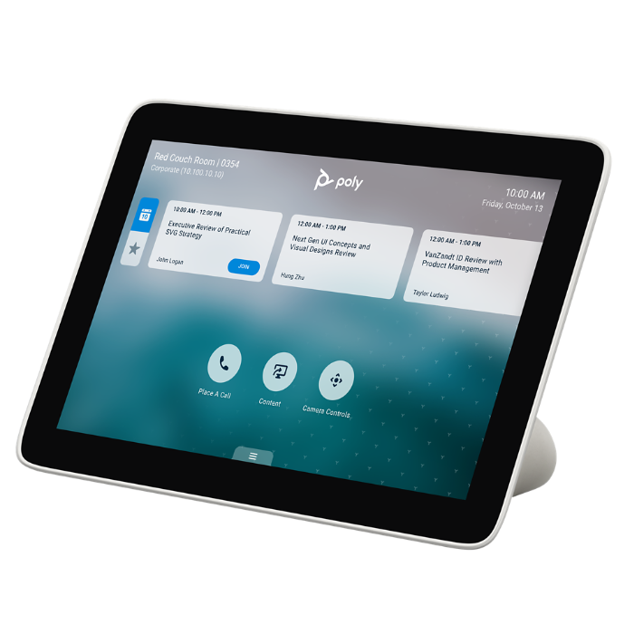
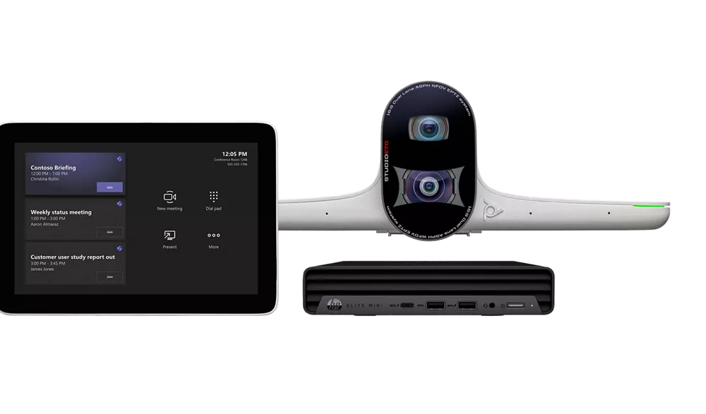
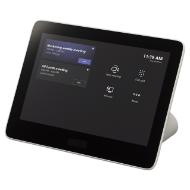

# Yealink

Yealink Video Device Solutions for Microsoft Teams, Empowering Your Business

In the modern teams conference room, organization employees tend to do communication and collaboration with video meeting.

A video meeting not only delivers instant collaboration and communication environment, but fosters productivity and sometimes sparks innovations in a team work.

Fully integrated with Microsoft Teams and cover all the meeting room size, Yealink Teams room system solutions comes with full package devices offer including everything you need for a Microsoft Teams meeting room. Easy to use with premium video and audio experience, the solutions are able to make the teamwork more efficient and collaborative across all meeting spaces.

Below you will find Poly recommendations for each room type, either if you are looking for Android-based systems or Windows-based deployments for Meeting Rooms.

## Focus & Small Room

### Android

- **Yealink MeetingBar A10** [🔗](https://https://www.yealink.com/en/product-detail/microsoft-teams-rooms-meetingbar-a10)

The MeetingBar A10's compact design makes it perfect for small spaces and home offices, and it can be set up in minutes. With 4K camera and 120° field of view, capture all important details in the room clearly with great color. The built-in 8 MEMS beamforming microphones and speakers in MeetingBar A10 provide full coverage of small spaces for a worry free, full-duplex voice experience. Yealink's enhanced AI noise cancellation enhances the audio experience, leveraging a massive deep-learning sound database to reduce background noises, distracting keyboard clatter, mouse clicks, and footsteps, as well as smartly erase other ambient noises to provide crystal-clear audio quality.

Being integrated into a Focus Room, we recommend adding a touchscreen enabled monitor into the room and connect it to the A10. This way, the controlling part of the Meeting Room will be handled directly on the monitor. Otherwise, we recommend adding a CTP18 Touch Panel for meeting control directly on the meeting table. THe CTP18 Touch Panel is described below.

- **Yealink MeetingBar A20 with CTP18 Touch Panel** [🔗](https://www.yealink.com/en/product-detail/microsoft-teams-rooms-meetingbar-a20)

Designed with simplicity, Yealink MeetingBar A20 integrates the conference room webcam, microphone and speakers into an all-in-one system. No PC or individual components are required, allowing plug-and-play for a dedicated small meeting room setup within minutes, greatly reducing the time needed for deployment and management. In addition, connecting to a CTP18 touch panel can be realized for better meeting control.

### Windows

- **Yealink MVC400** (Yealink UVC40 Camera, Yealink MCore Mini-PC, MTouch II Touch Panel) [🔗](https://www.yealink.com/en/product-detail/microsoft-teams-rooms-mvc400)

Getting started with Yealink UVC40, the all-in-one USB video bar offers a video and voice experience with an integrated AI-powered camera, microphone arrays and speaker. With the MTouch II and MCore mini-PC, Yealink MVC400 video solution for Teams conference rooms brings a dedicated MTR system that meets the requirements of focus and small meeting rooms. The Yealink UVC40 is equipped with AI technology, including Auto Framing and Speaker Tracking. With the 133° wide-angle lens and Auto Framing, the UVC40 can recognize the number of and the position of attendees, framing everyone smoothly in the most appropriate view even in small spaces. The Speaker Tracking technology with 20MP camera brings a vivid face-to-face meeting in a high-definition visual experience. In addition, with an electric lens cap, the UVC40 camera can automatically turn on and off with the aid of its detection function, securing the privacy of your MVC400 Teams conference rooms. With Yealink Noise Proof Technology and dereverberation, the UVC40 with built-in 8 MEMS microphone arrays and speaker allow users to enjoy full-duplex voice experience seamlessly without interruption and talking freely in a comfortable way. In Yealink MVC II series Microsoft Teams conference room equipments, the MCore cable management solution integrates data transmission and power supply cables into one CAT5e cable, provides a straightforward solution to complicated cabling and reduces the deployment time in your Teams conference room. For MVC400 Teams conference room system, easy deployment can be realized with just connecting the MTouch II and the UVC40 to the MCore mini-PC.

## Midsize Room

### Android

- **Yealink MeetingBoard 65** [🔗](https://www.yealink.com/en/product-detail/microsoft-teams-rooms-meetingboard65)

Yealink MeetingBoard consists of a 4K camera, crystal-clear speaker, full-duplex microphones, and a 65/86 inch smart collaboration whiteboard to provide an immersive meeting experience and allow collaboration anytime, anywhere. With the 4K camera and powerful encoding and decoding capabilities, MeetingBoard realizes truly smooth and stable HD Teams meetings. Powered by AI technology, the camera brings diverse views such as Auto Framing, Speaker Tracking, Multi-Focus Framing and Picture-in-Picture. MeetingBoard's interactive and inventive features such as premium inking, collaborative diagrams, fluid components, and other rich content, help boost team creativity and productivity. Powered by the Microsoft Whiteboarding, it ensures a seamless real-time collaboration during brainstorming, project planning or problem solving by simple clicks on the smart whiteboard.
This device is excellent in any type of room, from meeting room, training room up to co-creation spaces and manager's office room.

- **Yealink MeetingBar A30 with CTP18 Touch Panel** [🔗](https://www.yealink.com/en/product-detail/microsoft-teams-rooms-meetingbar-a30)

Designed with simplicity, the all-in-one video conferencing bar, Yealink MeetingBar A30 integrates an optical camera, 8 MEMS microphone arrays, and speakers into an all-in-one system. No PC or individual components are required, allowing plug-and-play for a dedicated small meeting room setup within minutes, greatly reducing the time needed for deployment and management. In addition, connecting to a CTP18 touch panel can be realized for better meeting control.

===============================================================================

### Windows

- **Poly Medium Room Kit** (Poly Studio, Poly GC8) [🔗](https://www.poly.com/us/en/solutions/platform/microsoft/video/teams-rooms-windows)
- **HP Mini Conferencing PC** with Microsoft Teams Rooms

## Large Room

### Android

- **Poly G7500** [🔗](https://www.poly.com/us/en/products/video-conferencing/g/g7500)

If you want more control over your meeting spaces, the Poly G7500 is ready. This modular video conferencing system makes it easy to outfit conference rooms to meet your organization’s unique needs. Loaded with flexible features, the G7500 leverages your design to power your meetings and wow your teams.

- Seamlessly connects to cameras, microphones, and other 3rd party components
- Built-in video apps for native full-featured experiences
- Includes Poly NoiseBlockAI and Acoustic Fence technologies

- **Poly TC8 Console** [🔗](https://www.poly.com/gb/en/products/video-conferencing/accessories/tc8)

Intuitive touch interface lets you access Teams meetings features with ease. Its sleek design features an 8" high-resolution touch display to make control options clear and accessible. Launch, join and share in an instant, while keeping your focus on the task at hand.

- **Poly E70** [🔗](https://www.poly.com/us/en/products/video-conferencing/studio/studio-e70)

The Poly Studio E70 is a first-of-its-kind intelligent camera that super-charges meeting rooms with mind-blowing video quality and next-level analytics. Dual camera with 20-megapixel 4K sensors are boosted by Poly DirectorAI smart camera technology to create a completely unrivaled video experience – perfect for hybrid working environments.

### Windows

- **Poly Large Room Kit** (Poly Studio E70, Poly GC8) [🔗](https://www.poly.com/us/en/solutions/platform/microsoft/video/teams-rooms-windows)
- **HP Mini Conferencing PC** with Microsoft Teams Rooms

> **Warning**
> **The Poly large room solutions do not include audio capabilities.**
> For audio it is recommended to go with a dedicated provider.
> Example: Nureva HDL300 (1-2 pieces) or standard Poly USB audio devices (Poly Sync 40-M [🔗](https://www.poly.com/us/en/products/phones/sync/sync-40), Poly Sync 60-M [🔗](https://www.poly.com/us/en/products/phones/sync/sync-60) and/or Poly Trio C60 [🔗](https://www.poly.com/us/en/products/phones/trio/trio-c60)).

## More details on above-mentioned products and solutions

## Poly GC8 Touch Console [🔗](https://www.poly.com/us/en/support/products/video-conferencing/group-solutions/poly-gc8)
The Poly GC8’s intuitive touch interface provides easy access to Poly Window-based conferencing solutions.

Poly GC8 features:

- Compatible with Microsoft Teams Rooms on Windows
- Integrated calendar for one-touch to join a call
- Easily share content, adjust the camera, and change participant layouts
- HDMI Ingest cable support

> **Warning**
> The Poly GC8 Touch Console only work with Windows-based certified Teams compute devices, while the Poly TC8 Touch Console will work only with Android-based systems: X-Series and G7500.

## The HP Mini Conferencing PC with Microsoft Teams Rooms

*The HP Mini Conferencing PC delivers power and performance from every angle with the latest 12th Gen Intel® Core™ i7.*

Empower your teams with rich, collaborative experiences across town and around the world in an instant. The HP Mini Conferencing PC with Microsoft Teams Rooms is designed to work with Poly Studio Room Kits for Microsoft Teams Rooms.

Setting up your conferencing space is fast and easy with the latest Intel® processor driven PC that has Microsoft Teams Rooms preinstalled
Get a highly secure and manageable PC that has the self-healing protection of HP Sure Start Gen7.
Get powerful performance from Windows IoT and the latest Intel® processor
HP Mini Conferencing PC with Microsoft Teams Rooms.

- 12th Generation Intel® Core™ i7 (12700T)
- 16GB RAM
- 256GB SSD

This is one of the most powerful compute options for Microsoft Teams Rooms on Windows you may find on the market.