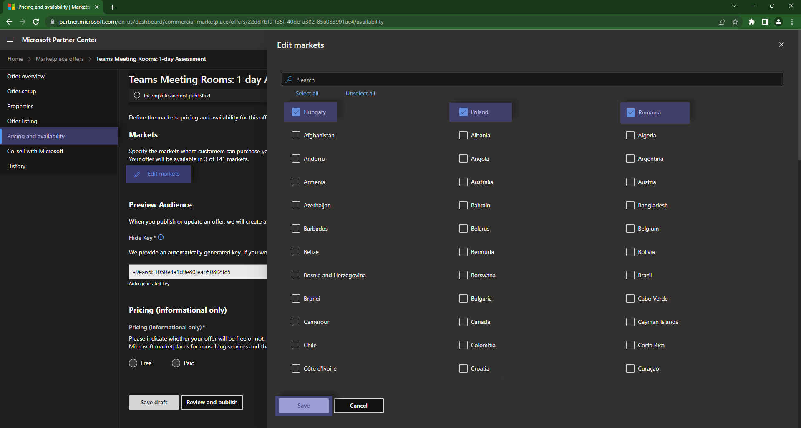
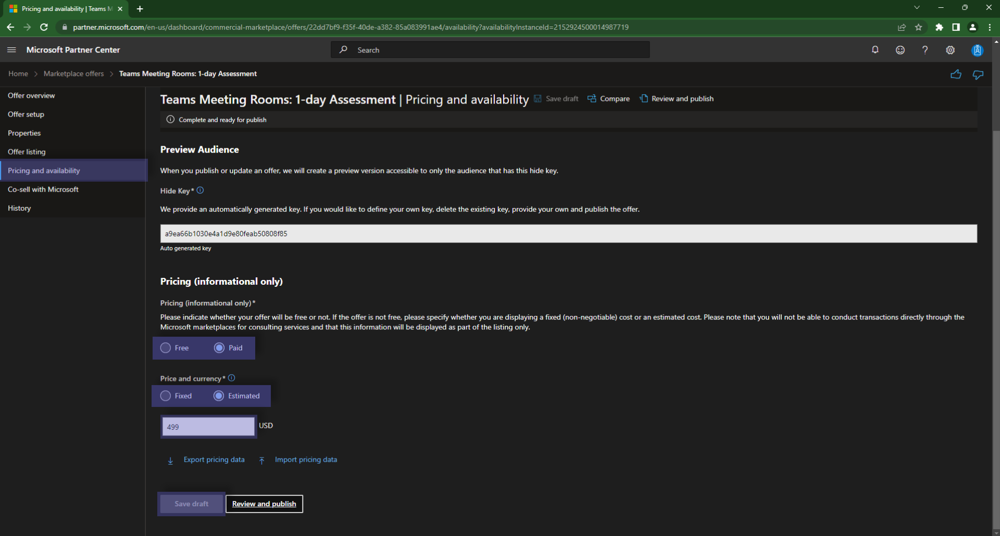
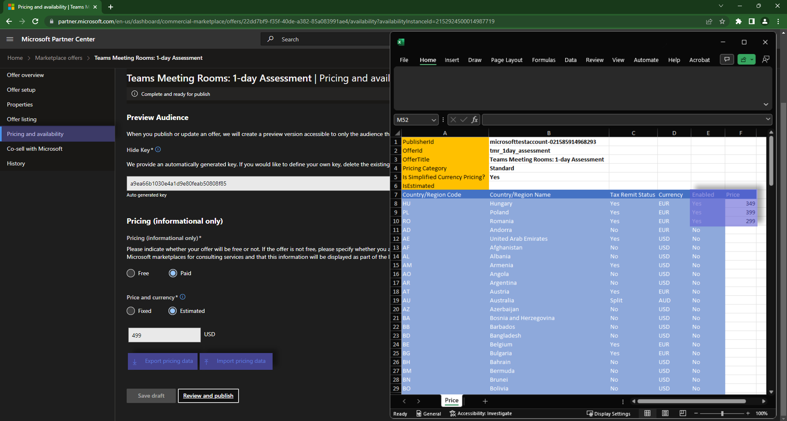

# Step 5: Pricing and availability

## Countries

The first section that you will need to define is the Countries in which the Offering will be available:

## Pricing

The second section that you will need to complete is regarding the Pricing model that you want to apply.  
Over here you can choose between `Free` or `Paid` and between `Fixed` and `Estimated`.  

> **Warning**
> Even if you want to configure prices via Excel file, do not skip this step, as it will result in your offer having errors.

## Multi-geo pricing

## Next Steps

Don't forget to hit `Save Draft` before moving on to the next page.  
The next step that you will need to take is to [publish your offer](publish.md)
