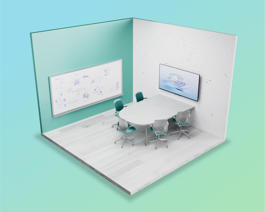
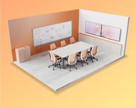
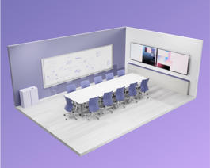

# What's the use of this?

Why we got to hybrid meetings, how we got here, how we handled it and how we're NOW transitioning to a new reality: a hybrid workplace.

# Principles of Hybrid Meetings

Everyone is seen, everyone is heard, everyone is engaged.
Everything is easy, everything is secure, everything is reliable.

# Why hybrid meetings?

Technology evolves, but there's one thing which sparks innovation and will never change: people.
More specifically connected people.

## Where we deploy a Teams Meeting Rooms Device?

There are 5 types of rooms that are generally available in various working/learning/meeting spaces:
- **Focus Room**: small ad-hoc space (generally 3 x 3 meters in size) that can accomodate three to five people.

- **Small Room**: small room (generally 4 x 6 meters) that can accomodate up to eight people.

- **Midsize Room**: Generally 4 x 8 meters that can accomodate up to 14 people.

- **Large Room**: Generally 6 x 10 meters that can accomodate 20 or more people.

- **Custom built room** (example: auditoriums, amfitheaters, rooms that need to be divided into separate meeting spaces etc.)

To see an overview per manufacturer for each main room type (focus, small, midsize, large) please follow each vendor page.

## Differences between Android-based VS Windows-based Teams Meeting Rooms [🔗](https://learn.microsoft.com/en-us/microsoftteams/rooms/teams-devices-feature-comparison)

Microsoft Teams Rooms experiences are designed with customers in mind. Every customer has unique needs, which is why Microsoft offers a breadth of options, including Teams Rooms on Windows and on Android.

Core functionality is available on both platforms so end users can always have great audio and video experiences, use one-touch join to join meetings, and access inclusive features such as live captions and raise hand.

To help guide you as to what features are available on different platforms, you can refer to the chart below, which will be updated periodically. Not all Teams Rooms features will be included on this list, so please continue to consult the [Microsoft 365 roadmap](https://www.microsoft.com/en-ww/microsoft-365/roadmap?rtc=1&filters=)
