# Configuring an HTTPS webhook in Azure

More in-depth technical documentation is available [here](https://learn.microsoft.com/en-us/partner-center/marketplace/partner-center-portal/commercial-marketplace-lead-management-instructions-https)

## Create Resource Group

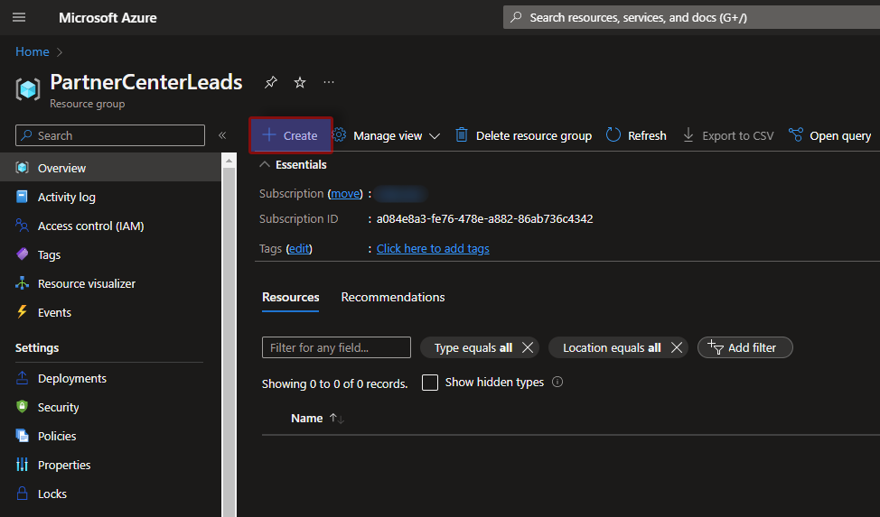

## Create a Logic App

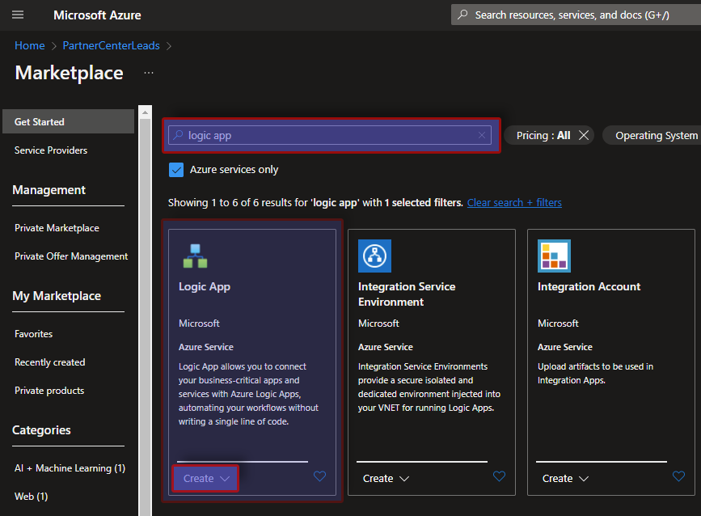
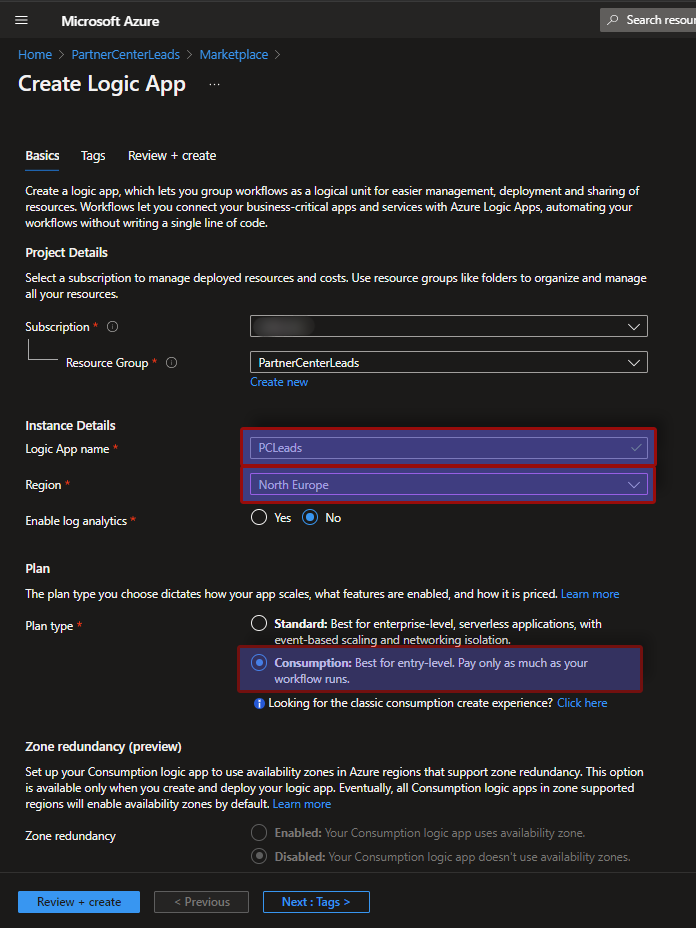

## Go to Logic App Designer and configure the trigger

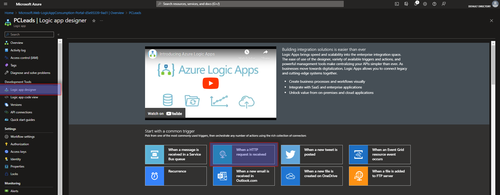
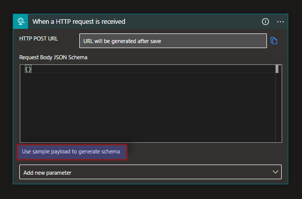
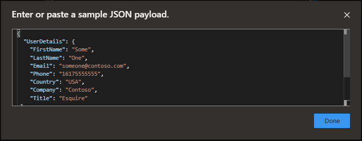

## Connect to Outlook from Office 365

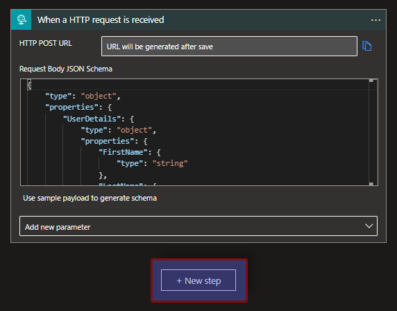
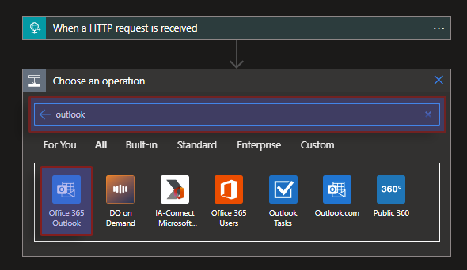
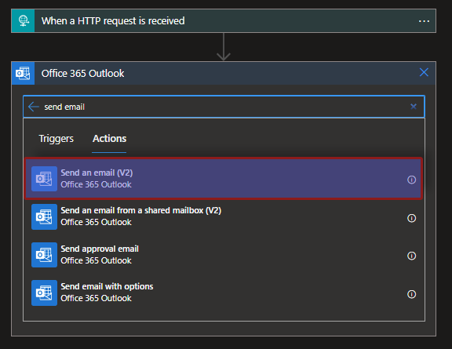
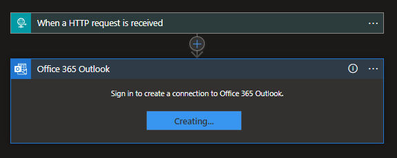

## Define the Email action

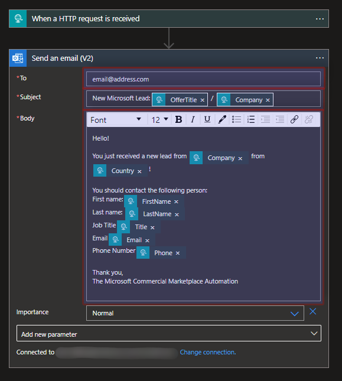

Subject:

```markdown
New Microsoft Lead: @{triggerBody()?['OfferTitle']} /  @{triggerBody()?['UserDetails']?['Company']}
```

Body:

```markdown
Hello!

You just received a new lead from @{triggerBody()?['UserDetails']?['Company']} from @{triggerBody()?['UserDetails']?['Country']}!

You should contact the following person:
First name:@{triggerBody()?['UserDetails']?['FirstName']}
Last name: @{triggerBody()?['UserDetails']?['LastName']}
Job Title@{triggerBody()?['UserDetails']?['Title']}
Email@{triggerBody()?['UserDetails']?['Email']}
Phone Number@{triggerBody()?['UserDetails']?['Phone']}

Thank you,
The Microsoft Commercial Marketplace Automation
```

## Output

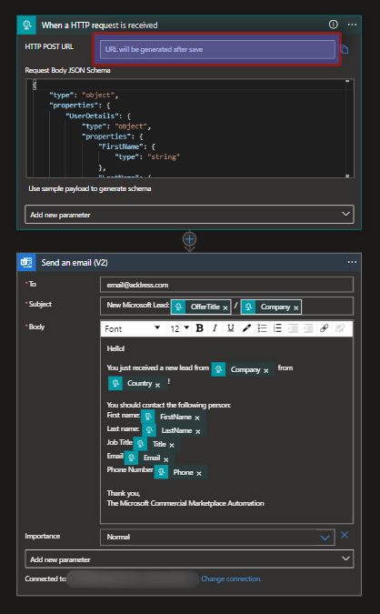
