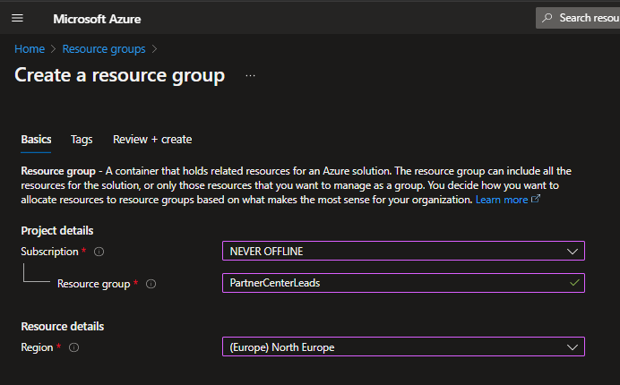

# Configuring an HTTPS Webhook in Azure

The Microsoft Commercial Marketplace allows you to configure a Webhook to receive leads from your offering. But receiving them is not enough, as you will need to do something with them. In this section, we will show you how to create a simple webhook that will send you an email whenever a new lead is received!

A cheap, simple, fast and easy way of creating a Webhook is by using **Azure Logic Apps**, which has a `Consumption Plan` billing model. This means that you will only pay for the resources that you use, and you will not be charged when the Logic App is not being triggered. At the moment of writing this, each `Consumption Plan` comes with the first 4000 actions for free. The updated pricing details can be checked out [here](https://azure.microsoft.com/en-us/pricing/details/logic-apps/).

## ...but what is a Webhook?

Imagine you have a special mailbox at home that can magically send you a message whenever something important happens outside your house. Let's say you're waiting for your friend to visit. Instead of constantly looking out the window, you can ask your mailbox to notify you when your friend arrives. When your friend rings the doorbell, the mailbox sends you a message right away, so you know your friend is here without having to keep watching. Webhooks work kind of like that magical mailbox for websites and apps. They help them communicate and send each other messages automatically when certain events happen, like a new message on social media or someone buying something in an online store. Or even a lead from the Commercial Marketplace! It saves time and lets different parts of the internet talk to each other easily!

## Create Resource Group

The first thing that we will need is to [create a Resource Group](https://portal.azure.com/#create/Microsoft.ResourceGroup). The aspects which you should decide upon are:

- which is the `Azure Subscription` that you will use
- what is the name of the `Resource Group` that you will be creating
- what is the `Region` in which this Resource Group will reside



In our example, we are using a subscription called `NEVER OFFLINE`, a Resource Group called `PartnerCenterLeads` in the region of `North Europe`.
After completing the form, click on `Review + Create` and then on `Create`. In a few seconds, the Resource Group will be created.

## Create Logic App

After creating the `Resource Group` you will need to go to it and create a new `Logic App`.  
You can do this by clicking on `+ Create` in the top left corner.


A new window should open up, in which you should search for `Logic App`:


After clicking on `Create`, you will be presented with a form that you will need to fill in.

The `Logic App` details that you will need to fill in, in the order of setting up, are:

- Plan Type, which is the model of deployment (recommended: `Consumption`)
- which is the `Azure Subscription` that you will use
- which is the `Resource Group` in which this `Logic App` will reside
- what is the `Name` of the `Logic App` that you will be creating
- what is the `Region` in which this `Logic App` will reside
- if you want to enable `Log Analytics` (optional)


After completing the form, click on `Review + Create` and then on `Create`. In about a minute, the Logic App will be created!

## Go to Logic App Designer and configure the trigger


## Connect to Outlook from Office 365


## Define the Email action


Subject:

```markdown
New Microsoft Lead: @{triggerBody()?['OfferTitle']} /  @{triggerBody()?['UserDetails']?['Company']}
```

Body:

```markdown
Hello!

You just received a new lead from @{triggerBody()?['UserDetails']?['Company']} from @{triggerBody()?['UserDetails']?['Country']}!

You should contact the following person:
First name:@{triggerBody()?['UserDetails']?['FirstName']}
Last name: @{triggerBody()?['UserDetails']?['LastName']}
Job Title@{triggerBody()?['UserDetails']?['Title']}
Email@{triggerBody()?['UserDetails']?['Email']}
Phone Number@{triggerBody()?['UserDetails']?['Phone']}

Thank you,
The Microsoft Commercial Marketplace Automation
```

## Output


