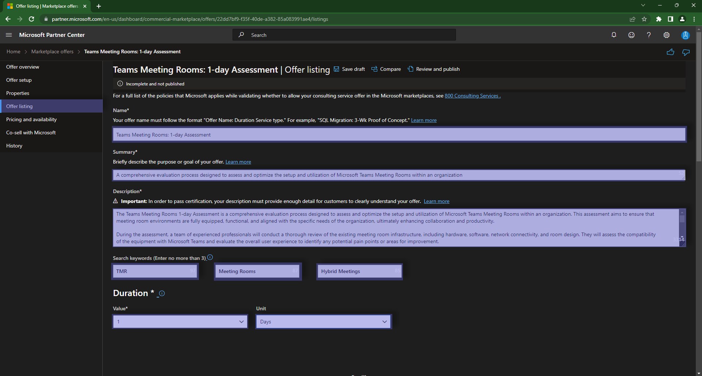
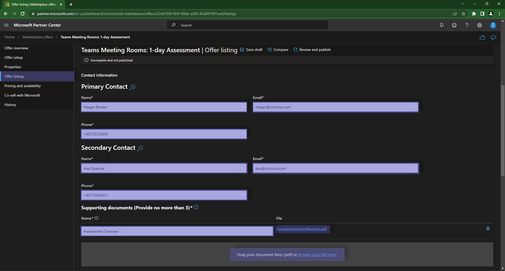
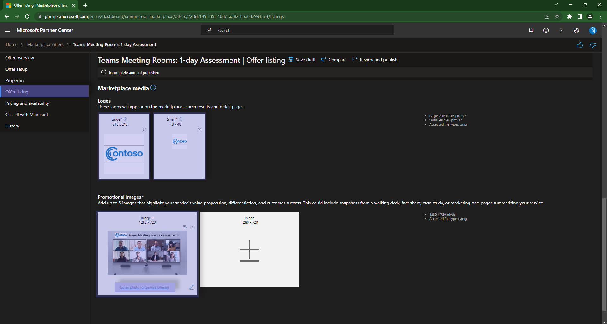

# Step 4: Offer listing

The Offer Listing is the biggest part of the publishing process, and it is the one that will be visible to customers.
In this section you will need to define the following:

- Name -- Offering Title that will be visible to customers
- Summary -- short description, to be shown through the "Search" page
- Description -- long description, to be shown on the offer page
- Search Keywords -- to be used for search indexing
- Duration -- how long does it take you to deliver the service?
- Primary Contact, including email and phone number
- Secondary Contact, including email and phone number
- a service presentation in PDF format
- a PNG logo with 256x256px resolution
- a PNG offering image with 1280x720px resolution

> **Warning** Please check the [Certification Policies](https://learn.microsoft.com/en-us/legal/marketplace/certification-policies) before publishing your offer.
> The name should follow a convention: `Title: Duration, Type of Service`. Example: `Teams Meeting Rooms: 1-day Assessment`



```markdown
# Example values from above screenshot

Name: `Teams Meeting Rooms: 1-day Assessment`
Summary: `A comprehensive evaluation process designed to assess and optimize the setup and utilization of Microsoft Teams Meeting Rooms within an organization`
Description: `Long and well described description of your service offering`
Search keywords: `TMR`, `Meeting Rooms`, `Hybrid Meetings`
Duration Value: `1`
Duration Unit: `Days`
```





`Save Draft` before moving on to the next page.

The next step that you will need to take is to [define your Pricing and Availability](pricingavailability.md)

