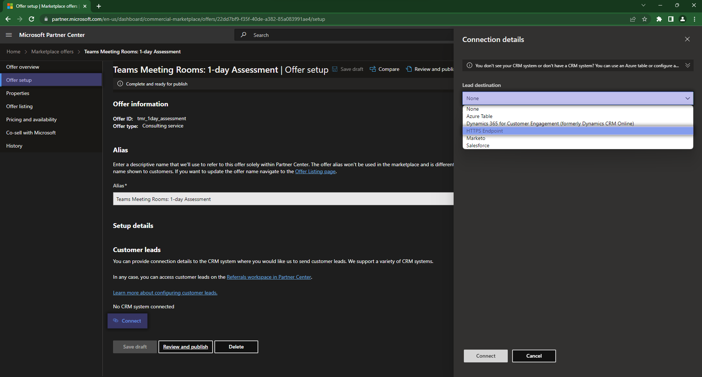
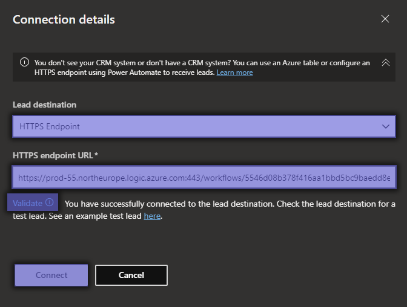
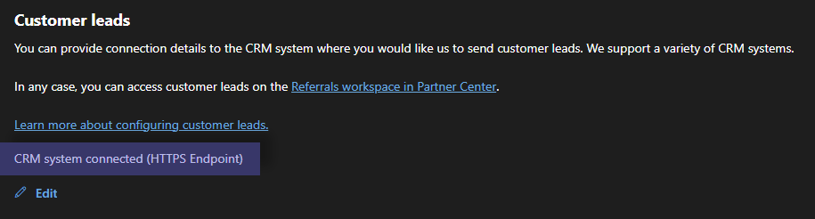

# Step 2: Offer Setup

The first thing that you will need to configure after creating a `+ New Offer` is to configure where the leads that come from the respective offering will go. For this, you have [multiple options available](https://learn.microsoft.com/en-us/partner-center/marketplace/create-consulting-service-offer#configure-lead-management) as destinations.

## HTTPS Endpoint

Given the context & assumptions, we will be using the [`HTTPS Endpoint`](https://learn.microsoft.com/en-us/partner-center/marketplace/partner-center-portal/commercial-marketplace-lead-management-instructions-https) destination:

After you select the `HTTPS Endpoint` and insert the URL of your endpoint, you will need to `Validate` the endpoint.  
If the validation is successful, go ahead and hit `Connect` on the form.

> **Info**
> If you do not have an HTTPS endpoint, please see [this section](./azure_webook.md) to find out how to easily create one using Azure.

If you have done all the steps correctly, you should have received a Sample Lead through the configured Endpoint, and the platform should confirm that the connection was configured successfully.

## Next Steps

Before moving on to the next page, you will need to `Save Draft` on the initial offering.  
The next step that you will need to take is [setting up the proprieties](proprieties.md)
