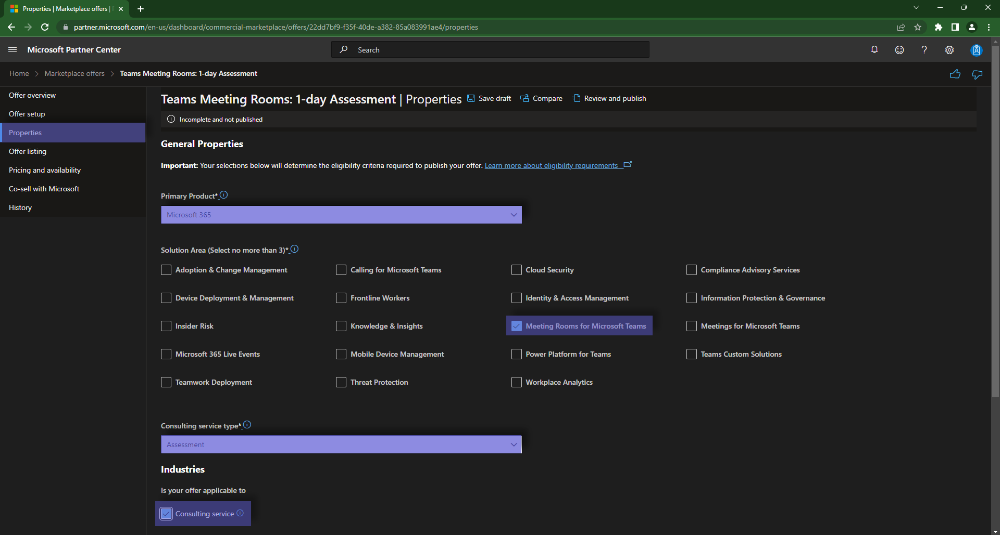

# Step 3: Proprieties

On the next page, we will configure the Primary Product associated with our offering as `Microsoft 365`.  
We will also select the Solution Area that corresponds to our offering as being `Meeting Rooms for Microsoft Teams`.

Note: if multiple Solution Areas correspond to your offering, you can select up to a maximum of 3.

This is also the place in which we will select the `Assessment` type of the offering.

Don't forget to hit `Save Draft` before moving on to the next page.

The next step that you will need to take is to [define the page with the offer listing](offerlisting.md)
