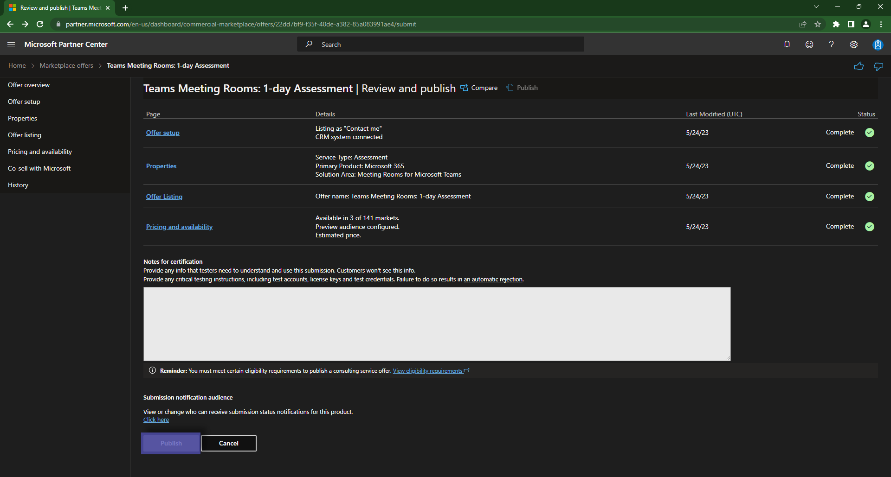

# Step 6: Publishing

After completing all the steps, you need to click `Review & Publish` on the top bar of the offering.  

This will take you to a validation overview, where you can see if all the automated checks have passed!

If everything is configured and no errors are present, you are ready to hit `Publish`!
