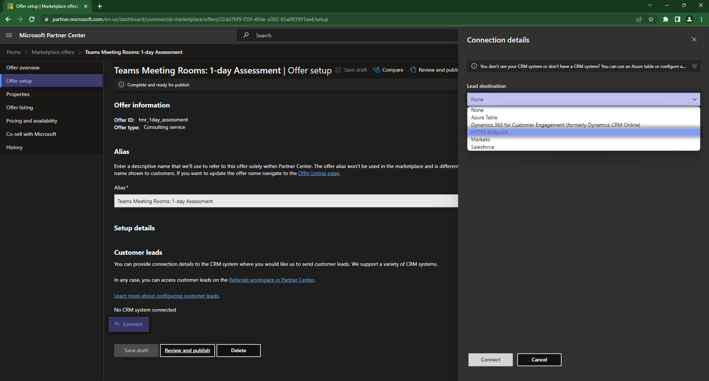
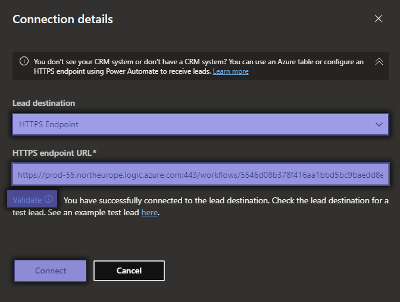
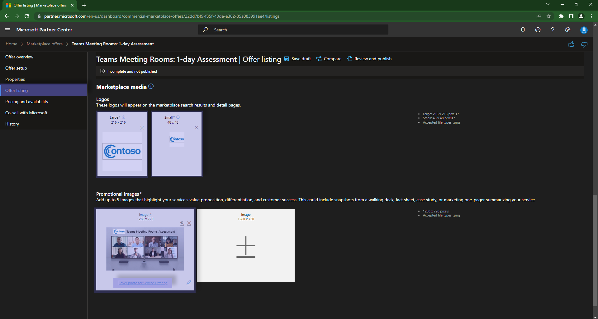
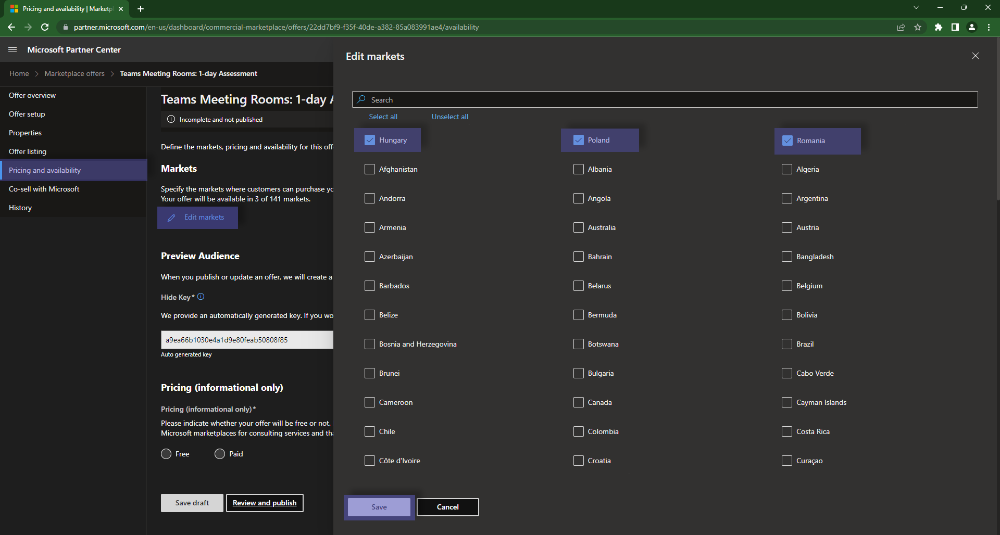
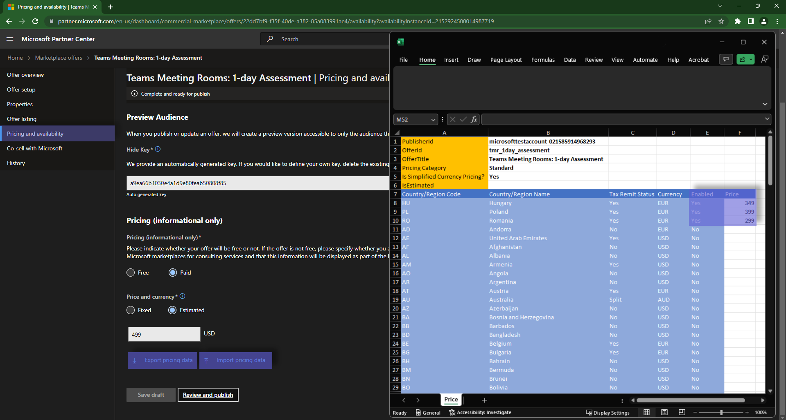

# Commercial Marketplace > Consulting Services

To begin, you will navigate to the [Partner Center](https://partner.microsoft.com/en-us/dashboard/home), more specifically the [Commercial Marketplace](https://partner.microsoft.com/en-us/dashboard/commercial-marketplace/overview) section. Within this module of Partner Center, you gain access to essential features for creating and managing your offerings intended for publication on the Microsoft Commercial Marketplace. There are [multiple types of offerings](https://learn.microsoft.com/en-us/partner-center/marketplace/determine-your-listing-type) that you can publish on the Microsoft Commercial Marketplace, and each has its settings and lifecycle.

**Consulting Services** themselves are of 5 types:

- **Assessment**: An evaluation of a customer's environment to determine the applicability of a solution and to estimate the cost and timeline of its implementation.
- **Briefing**: An introduction to a solution or a service using frameworks, demos, and customer examples.
- **Implementation**: A complete installation that results in a fully working solution.
- **Proof of concept**: A limited-scope implementation to determine whether a solution meets the customer's requirements.
- **Workshop**: An interactive engagement conducted on the customer's premises. It can involve training, briefings, assessments, or demos built on the customer's data or environment.

> **Warning**
> Each published offering will need to belong to one of these categories, and the category should be included in the name of the offering.

## Context & assumptions

For the purpose of this guide, we will start with the following assumptions:

- we are a Microsoft Partner with an `active Partner Designation on Modern Work`
- we want to publish a `Consulting Services`
- the service is of type `Assessment`
- the technology that we focus on is `Teams Meeting Rooms`
- delivering this service to a Customer would take us `1 day`
- we want to publish this service in `Romania`, `Poland` and `Hungary`
- we want differentiated pricing for each country
- we do not have a CRM system
- we have access to an Azure subscription

## Step 1: Creating a new offer

We will start creating a new offer by clicking on the `+ New offer` button and selecting `Consulting Services`. A panel will show from the right side, and you will need to complete the fields that will be displayed. Please note that the `Offer ID` and `Offer Alias` defined here will be used internally in Partner Center and will not be visible to customers - it is recommended to use a naming convention that will help you identify the offer later on.


```markdown
# Example values from above screenshot

Offer ID: `tmr_1day_assessment`
Offer Alias: `Teams Meeting Rooms: 1-day Assessment`
```

## Step 2: Offer Setup

The first thing that you will need to configure after creating a `+ New Offer` is to configure where the leads that come from the respective offering will go. For this, you have [multiple options available](https://learn.microsoft.com/en-us/partner-center/marketplace/create-consulting-service-offer#configure-lead-management) as destinations. Given the context & assumptions, we will be using the [`HTTPS Endpoint`](https://learn.microsoft.com/en-us/partner-center/marketplace/partner-center-portal/commercial-marketplace-lead-management-instructions-https) destination.



> **Warning**
> If you do not have an HTTPS endpoint, please see [this section](./azure_webook.md) on how to easily create one using Azure.

After you select the `HTTPS Endpoint` and insert the URL of your endpoint, you will need to `Validate` the endpoint.  
If the validation is successful, go ahead and hit `Connect` on the form and then `Save Draft` on the initial offering, before moving on to the next page.



## Step 3: Proprieties


`Save Draft` before moving on to the next page.

## Step 4: Offer listing





`Save Draft` before moving on to the next page.


## Step 5: Pricing and availability






`Save Draft` before moving on to the next page.


## Step 6: Publishing


`Save Draft` before moving on to the next page.


## Step 7: Co-sell with Microsoft

## Post Publishing

### Extra resources

- [Consulting Services documentation](https://learn.microsoft.com/en-us/partner-center/marketplace/plan-consulting-service-offer)
- [Pricing](https://learn.microsoft.com/en-us/partner-center/marketplace/marketplace-geo-availability-currencies)